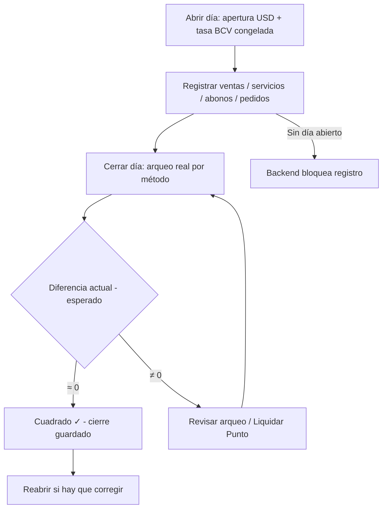
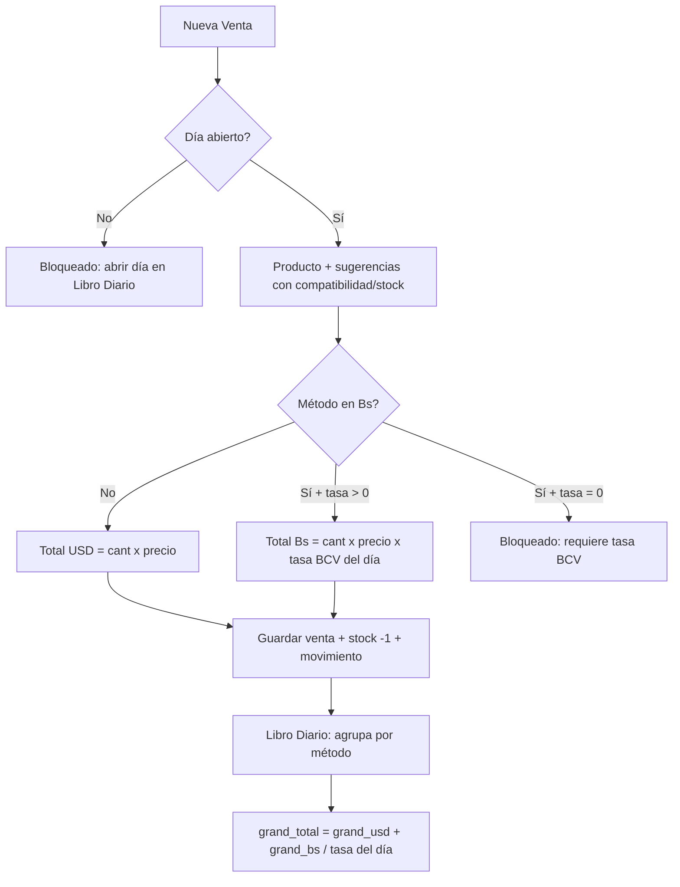
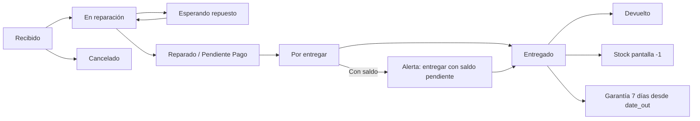
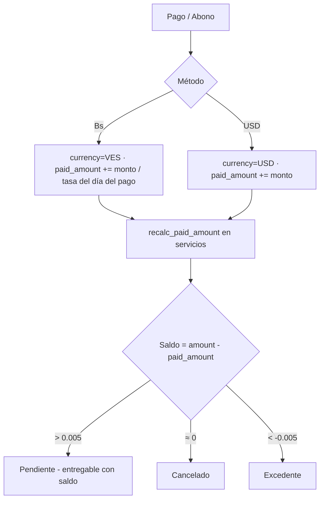
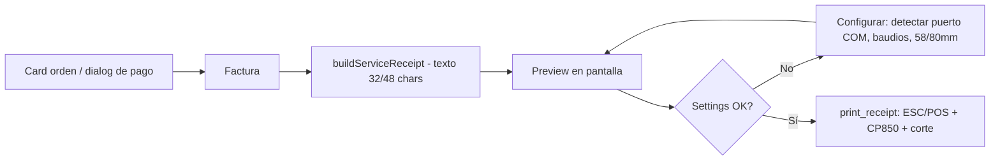

# PRD — Registro · Sistema de Servicio Técnico

> **Versión:** 1.0 · **Fecha:** 2026-08-04 · **Estado:** En producción (v0.2)
> **Repositorio:** https://github.com/shaman2527/Service_Tecnico

---

## 1. Resumen del producto

**Registro** es una aplicación de escritorio **offline-first** (Tauri 2 + React 19 + SQLite)
para gestionar un servicio técnico de celulares: catálogo de pantallas/repuestos,
ventas con control de stock, órdenes de reparación con workflow, abonos y pagos
parciales, historial de clientes con saldos, pedidos a proveedores, **libro diario
(turno de caja con tasa BCV)** e impresión de facturas en impresora térmica (ESC/POS).

No requiere internet: los únicos usos de red son el scrapeo opcional de la tasa BCV
(BCV.org.ve vía `curl.exe`) y la descarga del WebView2 Runtime al instalar (la versión
instalada lo lleva embebido).

---

## 2. Problema y objetivos

### Problema
El negocio manejaba registro manual (papel/Excel): sin control de inventario en
tiempo real, sin historial consolidado por cliente, sin arqueo de caja diario y sin
factura impresa.

### Objetivos
1. Registrar ventas y reparaciones con **descuento automático de stock**.
2. Control de caja diario: apertura con tasa BCV congelada, cierre con arqueo por
   método de pago y diferencia calculada.
3. Historial por cliente con abonos y **saldos pendientes**.
4. Funcionar **sin internet** en una PC modesta de tienda.
5. Imprimir factura de servicio en impresora térmica de 58/80mm.
6. Proteger el acceso con **PIN** (owner/cajera) que nunca se pueda saltar.

### No-objetivos (v1)
- Sincronización multiusuario en la nube (el respaldo es copiar `registro.db`).
- Punto de venta físico integrado (la comisión se registra, la máquina es externa).

---

## 3. Usuarios

| Persona | Rol | Acceso |
|---|---|---|
| **Dueño** (Aldri/William) | Owner | Todo: Dashboard, inventario, clientes, libro diario, PIN, pedidos |
| **Cajera** | cashier | Ventas únicamente; entra con botón "Entrar como cajera" (salta a Ventas, sin Dashboard) |

**Autenticación:** PIN de 4 dígitos (default inicial `1234`, se cambia en Libro Diario →
PIN). Gate **fail-closed**: si la consulta de PIN falla en arranque, se pide el PIN igual
(nunca abre sin PIN; ver regla R-17).

---

## 4. Alcance funcional por módulo

### 4.1 Dashboard (owner)
- KPIs: Ventas Hoy (USD/Bs), Ventas 7 días, Equipos en Taller, Ingresos Servicios.
- Barras por categoría (CSS puro), Top 6 modelos, diagrama de flujo del workflow
  (Recibido→Entregado + terminales Cancelado/Devuelto), tablas de métodos/estados/stock bajo.
- Indicador "Sincronizado · datos locales" + última actividad.

### 4.2 Ventas
- Nueva venta: buscador de producto con chips de compatibilidad y stock (rojo si ≤0),
  cliente opcional (se crea solo), **cédula** opcional.
- Métodos de pago: Punto de Venta ($/Bs, comisión 3.5% default), Zelle (referencia),
  Divisas (USD Cash), Efectivo Bs, Pago Móvil, Transferencia Bs.
- **Conversión Bs:** si el método es en bolívares, `total Bs = $ × tasa BCV del día
  abierto` y se guarda en Bs (`currency='VES'`). Sin tasa válida → **bloquea** la venta.
- Filtros: periodo (Todo/7d/30d/mes), rango de fechas, búsqueda (producto/cliente/cédula).
- Totales separados `$X` + `Bs. Y`, nunca mezclados.

### 4.3 Servicio Técnico (órdenes)
- Card por orden (grid responsive) con cliente, equipo, falla completa, finanzas, técnico.
- Workflow: Recibido → En reparación → Esperando repuesto → Reparado/Pendiente Pago →
  Por entregar → **Entregado** / Cancelado / Devuelto.
- **Multi-trabajo** (`service_types` JSON): varios trabajos por orden
  (pantalla + conector + …), chips contadores por tipo, filtro por tipo.
- **Checklist de blindaje** 10 ítems Sí/No (chip SIM, tapa, bandeja, botones, cámara,
  puerto, parlante, contraseña, accesorios) + cédula y dirección del cliente.
- **Técnicos:** marca quién reparó (Aldri/William); gestión en dialog (color + iniciales).
- **Entrega rápida** desde la card: descuenta stock (auto-inventario) y activa garantía;
  con saldo pendiente pide confirmación.
- **Garantía 7 días** corridos desde `date_out` (badge en card + banner al editar).

### 4.4 Abonos y pagos parciales
- Dialog reutilizable (`PaymentDialog`) en toda card: método, monto en la moneda del
  método, referencia Zelle, notas, comisión Punto, historial con borrar.
- Moneda **siempre del método** (R-1). `paid_amount` = pagos USD + pagos Bs/tasa del
  día del pago (cierre del día → día abierto → fallback 1).
- Saldo honesto: pendiente (rojo), excedente (ámbar), cancelado (verde).
- Se permite **entregar con saldo** (deuda visible en orden y en el cliente).

### 4.5 Clientes
- Auto-creación (`addOrFindClient`), búsqueda tolerante de cédula (V-24906999 =
  24906999).
- Historial: servicios expandibles con equipo/diagnóstico completo, checklist,
  pagos desglosados (fecha, método, monto en su moneda, referencia, neto), saldos.

### 4.6 Inventario / Pantallas
- Catálogo con compatibilidad por modelo en chips, stock, precio costo/venta, categoría.
- Movimientos por producto (entrada/salida con motivo).
- Sugerencias de reposición (stock ≤ min_stock o agotados con salidas).

### 4.7 Pedidos a proveedor
- Pedidos con ítems (producto, cantidad, precio unitario); "Recibido" **suma stock** +
  movimiento de entrada; sugerencias "Pedir N" (min×2 − stock).

### 4.8 Libro Diario (turno de caja)
- **Un solo día abierto** a la vez (`daily_closings.is_closed=0`). Gate en backend:
  sin día abierto no se registra venta/servicio/abono/pedido.
- **Abrir día:** apertura en USD + tasa BCV congelada (Auto BCV scrapea la página
  oficial; fallback manual con aviso de última tasa registrada).
- Tabla diaria por rango: Pago Móvil, Efectivo Bs, Divisas $, Punto (neto en su
  moneda), Zelle/Transf si hay movimientos, Tasa BCV, Total "$ + Bs." + fila TOTALES.
- Total General del período con equivalente USD (`$X + Bs.Y` → `≈ $Z`).
- **Cerrar día:** arqueo real por método (precargado con esperados), monto impreso
  del Punto, diferencia `(actual − esperado)` en USD y Bs, notas; "Cuadrado ✓".
- **Liquidar Punto** y **reabrir** día posteriormente.
- Exportación CSV por rango (ventas, abonos, Pago Móvil, cierre con arqueo).

### 4.9 Impresora térmica
- `list_com_ports` con descripción VID/PID; ESC/POS con **CP850** para tildes.
- Settings persistidas: puerto, baudios, ancho 58/80mm (default 9600/58).
- `buildServiceReceipt`: factura a texto de 32/48 chars con wrap de falla, garantía
  7 días y abonos; preview en pantalla antes de imprimir.
- Botones: "Impresora" (toolbar) y "Factura" (card de orden + dialog de pago).
- Error amigable si el puerto no existe.

### 4.10 PIN de acceso
- `get_pin_status`/`verify_pin`/`set_pin`; gate fail-closed con reintentos (3×400ms).
- "Entrar como cajera" → rol cashier (solo Ventas).

### 4.12 Sistema de actualizaciones (launcher automático)
- Al arrancar (tras PIN), `check()` contra GitHub Releases (5s máximo; **sin internet = silencio**, la app offline-first nunca se bloquea). Aviso en pantalla "Nueva versión vX disponible" con el changelog, visible para owner y cajera.
- **Respaldo previo obligatorio:** exe actual → `updates\prev\`, DB (con checkpoint WAL) → `updates\registro.backup_pre_vX.db`, estado en `update-state.json`, y lanzamiento de `watchdog.ps1` (proceso aparte, 90s).
- Instalación pasiva (NSIS) → la app se cierra sola y el instalador la relanza.
- **Chequeo de salud post-update:** integridad DB + `next_order_num` + día activo + totales diarios (BCV como warning con fallback manual). OK → aviso "Actualizado ✓". FALLA → **rollback automático** a la versión anterior + relanzamiento (la tienda sigue operando mientras se corrige).
- **Watchdog:** si la versión nueva no arranca ni confirma en 90s, restaura el exe anterior y lo lanza.
- Botón "Revisar actualizaciones" + "Restaurar versión anterior" en el Centro de Ayuda.
- Publicación: `tools\release.ps1 -Version X.Y.Z -Notes "..."` (tests → bump → build firmado → `latest.json` con firma → GitHub Release). Requiere `gh auth login` y la llave privada `~\.tauri\registro.key` (si se pierde, no hay más updates).
- Verificación E2E completa (2026-08-04): flujo feliz con servidor local (dialog → kit → descarga → instalación → relanzamiento → health check → ok, DB intacta) y update roto (watchdog restaura y relanza).

### 4.13 Centro de Ayuda
- Guía en-app: accesos rápidos + accordion por módulo + métodos de pago.

---

## 5. Reglas de negocio (R)

| # | Regla |
|---|---|
| R-1 | **La moneda SIEMPRE la define el método de pago** (backend `normalize_payment_currency` + frontend `methodCurrency`). Bs: Efectivo Bs, Pago Móvil, Transferencia Bs, Punto de Venta (Bs). USD: Divisas, Zelle, Punto ($). |
| R-2 | **Conversión Bs→USD:** siempre dividir entre tasa BCV. En el Libro Diario se usa la tasa **de cada día** (cierre del día → día abierto → último cierre con tasa>0 → 0 = sin convertir). |
| R-3 | **El total guardado de una venta/abono está en la moneda del método** (la venta Bs guarda Bs = $ × tasa; el abono Bs guarda Bs tal cual). |
| R-4 | **Un solo día abierto.** `open_day` rechaza si hay uno; `close_day` solo cierra el abierto. |
| R-5 | **Día abierto obligatorio** para `add_sale`, `add_service`, `add_service_payment`, `add_purchase_order` (backend gate). |
| R-6 | **Tasa BCV congelada al abrir el día**; nunca se consulta en vivo al cobrar. |
| R-7 | **Auto-inventario:** entregar un servicio descuenta 1 pantalla compatible (auto-crea el producto si no existe → stock negativo visible); reabrir/borrar devuelve 1. |
| R-8 | **Garantía 7 días** desde `date_out` (auto-set al entregar, se limpia al reabrir). |
| R-9 | **`order_num` monotónico** (MAX+1, no reutiliza al borrar); prefijo y ancho derivados del último número (`DEV-0001` → `DEV-0002`); COALESCE para tabla vacía. |
| R-10 | **Apertura del día no es venta**: `initial_cash_usd` se guarda aparte y NO entra en totales. |
| R-11 | **`paid_amount`** (servicio, en USD): pagos USD directos + pagos Bs / tasa del día del pago (cierre del día → día abierto → 1). |
| R-12 | **Arqueo:** `diferencia = (actual − esperado)` separado por moneda, combinado como `diff_usd + diff_bs/tasa`. |
| R-13 | **Entrega con saldo permitida** por diseño (deuda visible). |
| R-14 | **Cierre cuadra:** el monto que el sistema espera por método digital es *locked*; solo Efectivo Bs y el monto impreso del Punto se corrigen en el arqueo. |
| R-15 | **PIN fail-closed:** error de IPC en arranque → pedir PIN (nunca abrir sin él). |
| R-16 | **Instalador no sobreescribe** la DB de una instalación existente. |
| R-17 | **Punto de Venta:** `net_amount = total − total×fee%` (comisión 3.5% default). |

---

## 6. Diagramas de flujo

### 6.1 Ciclo del día (Libro Diario)

### 6.2 Flujo de venta y conversión de moneda

### 6.3 Workflow de la orden de servicio

### 6.4 Abono / pago parcial

### 6.5 Impresión de factura

---

## 7. Modelo de datos (SQLite)

| Tabla | Propósito |
|---|---|
| `products` | Catálogo: brand, model, variant, price_cost/sale, stock, min_stock, compatibility (JSON), category_id |
| `categories` | Categorías de producto (Pantalla, Batería, …) |
| `clients` | Clientes (name, phone, ci, address, total_spent) |
| `sales` | Ventas: total en la moneda del método, currency, bank_fee_*, zelle_reference, client_id |
| `services` | Órdenes: order_num UNIQUE, client/phone/ci/address, model, fault, service_type(s), amount ($), status, checklist, technician(_id), date_in/date_out, paid_amount |
| `service_payments` | Abonos: amount en la moneda del método, currency, bank_fee_*, zelle_reference, payment_date, notes |
| `inventory_movements` | Movimientos de stock (entrada/salida + motivo + referencia) |
| `daily_closings` | Días: apertura, tasa BCV/EUR congelada, esperados por método, arqueo, diferencia, is_closed, total_usd/bs, pos_settled_bs |
| `purchase_orders` + `purchase_order_items` | Pedidos a proveedor |
| `payment_methods`, `service_statuses` | Catálogos de negocio |
| `technicians` | Técnicos (name UNIQUE, initials, color) |
| `settings` | KV: pin, printer_port/baud/width |

**Migraciones:** ALTER idempotente en `init()` (service_type(s), client_id, technician,
total_usd/bs, pos_settled_bs, currency fixes históricos, recálculo de cierres).
**Índices:** sales(date), service_payments(service_id), inventory_movements(product_id),
services(status/client), daily_closings(closed). PRAGMA: WAL, synchronous=FULL,
busy_timeout=5000.

---

## 8. Requisitos no funcionales

- **Offline-first:** todo funciona sin internet (solo BCV y WebView2 usan red).
- **Arranque rápido:** bundle principal 242KB + chunks lazy por pantalla; release LTO+strip
  13.1MB; arranque <3s.
- **Durabilidad:** `synchronous=FULL` (sobrevive apagones).
- **Respaldo:** copiar `registro.db` (WAL consolidado).
- **Instalación:** setup NSIS (~4.7MB) con WebView2 embebido (`embedBootstrapper`);
  instala en `%LOCALAPPDATA%\Registro Servicio Tecnico\` con la DB limpia junto al exe.
- **Pruebas:** suite Rust 20/20 (incl. conversión de moneda, arqueo, garantía, técnicos,
  next_order vacío, PRAGMAs); governance harness PASS.

---

## 9. Verificación aceptada (QA 2026-08-04)

Prueba E2E en sandbox aislado (copia de app + DB limpia) con tasa BCV **748.79**:

| Prueba | Esperado | Resultado |
|---|---|---|
| Venta $25 Divisas | usd_cash_total = 25 | ✓ |
| Venta Bs 7.487,90 = $10 × 748.79 (Pago Móvil) | pago_movil +7.487,90, currency VES | ✓ |
| Abono $20 + abono Bs 22.463,70 (= $30) | paid_amount = 50.00 | ✓ |
| Totales del día | grand_usd=45 · grand_bs=29.951,60 · grand_total=**85** (=45+40) | ✓ |
| Cierre con arqueo cuadrado | diferencia **0.00** · apertura $50 aparte · día cerrado | ✓ |
| UI Libro Diario | "Bs.29.951,60" + "$45.00" + "≈ $85.00 USD" | ✓ |
| UI Cierres | Pago Móvil, Divisas, Tasa 748.79, +$0.00, Cerrado | ✓ |
| `next_order_num` con tabla vacía | DEV-0001 sin crash | ✓ |
| Gate PIN en frío (app instalada) | pide PIN antes de abrir | ✓ |

---

## 10. Puesta en marcha (tienda)

1. Copiar `Registro Servicio Tecnico_0.1.0_x64-setup.exe` a la PC de la tienda.
2. Ejecutar (SmartScreen → "Ejecutar de todos modos").
3. Abrir la app → PIN `1234` → **cambiar el PIN** (Libro Diario → PIN).
4. Libro Diario → **Abrir día** (efectivo inicial + Auto BCV).
5. Servicio Técnico → **Impresora** → Detectar puerto COM → Imprimir prueba.
6. Respaldo: copiar `%LOCALAPPDATA%\Registro Servicio Tecnico\registro.db`.

---

## 11. Glosario

- **Bs / VES:** Bolívares. **USD:** Dólares.
- **Tasa BCV:** tipo de cambio oficial (Banco Central de Venezuela), congelada al abrir el día.
- **Arqueo:** conteo físico de caja al cierre.
- **Auto-inventario:** descuento automático de stock al entregar un servicio.
- **ESC/POS:** protocolo de impresoras térmicas.
