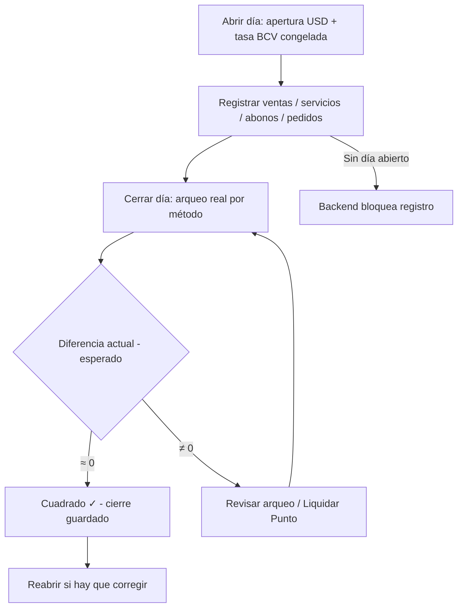
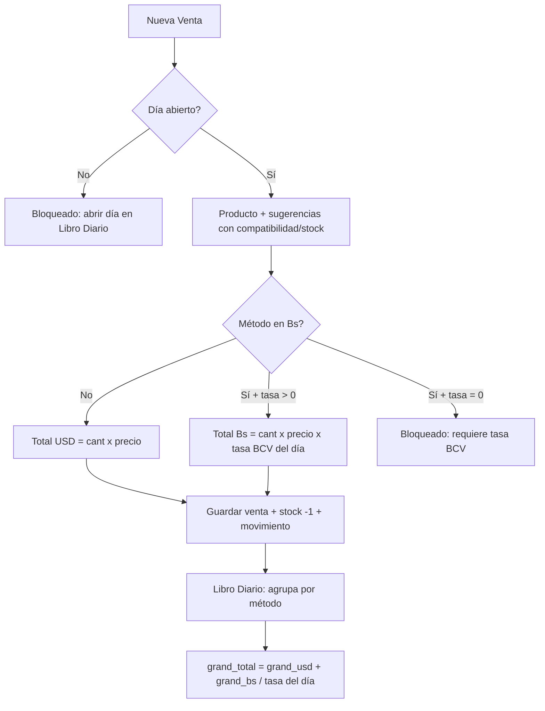
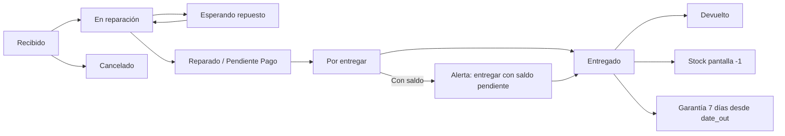
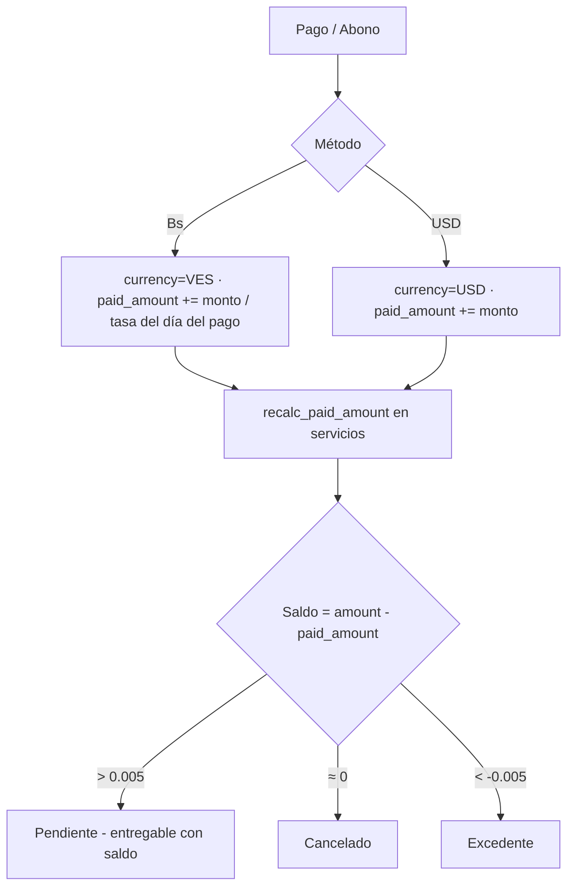
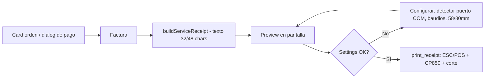

# Registro - Sistema de Servicio Técnico

Aplicación desktop **offline-first** para gestión de un servicio técnico de celulares:
inventario de pantallas y repuestos, ventas, órdenes de reparación, clientes con
historial, abonos/pagos parciales, pedidos a proveedores, **libro diario con tasa BCV**
y **factura en impresora térmica** (ESC/POS).

> 📄 Documento completo de producto (PRD): [PRD.md](PRD.md) — reglas de negocio,
> diagramas de flujo, modelo de datos y QA.
> 📋 Estado del proyecto (hecho + pendientes): [ESTADO.md](ESTADO.md)

## Repositorio

- **URL:** https://github.com/shaman2527/Service_Tecnico.git
- **Rama principal:** `main`

```bash
git clone https://github.com/shaman2527/Service_Tecnico.git
```

> **Nota:** la base de datos (`registro.db`), el binario (`Registro.exe`) y las planillas
> de datos están excluidos del repo (`.gitignore`) - son datos de negocio locales.

## Stack

- **Frontend:** React 19 + TypeScript + Vite + shadcn/ui + Tailwind CSS v4 + Lucide icons
- **Backend:** Tauri 2.0 (Rust) + rusqlite (SQLite)
- **DB:** SQLite local (offline-first) - respaldo = copiar `registro.db`
- **Impresora:** ESC/POS por puerto COM (CP850) - 58/80mm

## Funcionalidades

- **Ventas:** registro con descuento automático de stock, chips de compatibilidad y
  stock visible (rojo si agotado), métodos de pago (Punto $/Bs con comisión, Zelle con
  referencia, Divisas USD, Efectivo Bs, Pago Móvil, Transferencia Bs) y **conversión
  automática a bolívares** con la tasa BCV del día abierto. Filtros por periodo y fecha,
  búsqueda por producto/cliente/cédula.
- **Servicio Técnico:** órdenes de reparación con workflow (Recibido → … → Entregado),
  **multi-trabajo por orden** (pantalla + conector + …), checklist de blindaje 10 ítems
  Sí/No, cédula y dirección del cliente, **técnico responsable** (Aldri/William),
  garantía de 7 días desde la entrega.
- **Auto-Inventario:** al entregar un servicio se descuenta 1 de la pantalla compatible
  (auto-crea el producto si no existe; devuelve stock al reabrir o borrar).
- **Abonos y pagos parciales:** por orden con Total/Abonado/Saldo, historial de pagos con
  método/referencia/notas; moneda **siempre derivada del método**; abonos Bs convertidos
  con la tasa del día del pago; se permite entregar con saldo pendiente (deuda visible).
- **Clientes:** auto-creación sin duplicados, búsqueda tolerante de cédula, historial
  completo con pagos desglosados y saldos.
- **Libro Diario (turno de caja):** un solo día abierto a la vez; apertura con efectivo
  inicial y **tasa BCV congelada** (botón Auto BCV scrapea la página oficial con curl.exe,
  fallback manual); cierre con **arqueo real por método** y diferencia calculada;
  liquidación de Punto, reapertura y **exportación CSV** por rango.
- **Pedidos a proveedor:** sugerencias de reposición, recibir pedido → **suma stock**.
- **Impresora térmica:** `list_com_ports` + `print_receipt` (ESC/POS, CP850), settings
  persistidas (puerto/baudios/58-80mm), preview de factura antes de imprimir, botones
  "Impresora" y "Factura" en cada orden y en el dialog de pago.
- **PIN de acceso:** owner/cajera con gate **fail-closed** (nunca abre sin PIN).
- **Actualizaciones automáticas:** al arrancar revisa GitHub Releases (5s, sin molestar offline); aviso con changelog → **respaldo automático** (exe anterior + copia de la DB) → instalación pasiva → **chequeo de salud** (DB, órdenes, libro diario, BCV) → si falla, **vuelve sola a la versión anterior** (watchdog + rollback). Botón "Restaurar versión anterior" en Ayuda.
- **Dashboard:** KPIs (ventas hoy/7 días, equipos en taller, ingresos), diagrama de flujo
  del workflow, top modelos, stock bajo, indicador "Sincronizado".
- **Pantallas / Inventario:** catálogo con compatibilidad en chips, movimientos de stock.
- **Centro de Ayuda:** guía completa en-app.
- **Sidebar colapsable:** `w-64` ↔ `w-16`, persistido en localStorage.

## Diagramas de flujo

### Ciclo del día (Libro Diario)



### Venta y conversión de moneda



### Workflow de la orden de servicio



### Abono / pago parcial



### Impresión de factura



## Cómo funcionan las conversiones (resumen)

1. **La moneda siempre la define el método de pago** (Bs: Pago Móvil, Efectivo Bs,
   Transferencia Bs, Punto Bs · USD: Divisas, Zelle, Punto $).
2. **Venta en Bs:** `total Bs = $ × tasa BCV del día abierto` (se guarda en Bs).
3. **Libro Diario:** separa `grand_usd` y `grand_bs` por método; el equivalente es
   `grand_usd + grand_bs / tasa` — usando la **tasa de cada día** (cierre del día →
   día abierto → último cierre), nunca se mezclan monedas crudas.
4. **Abonos:** `paid_amount` (USD) = pagos $ + pagos Bs / tasa del día del pago.
5. **Cierre:** la apertura no es venta; el arqueo compara `actual − esperado` por
   método y la diferencia combina `diff_usd + diff_bs/tasa`.

> Verificado E2E (QA 2026-08-04): venta $25 + venta Bs 7.487,90 + abonos $20 y
> Bs 22.463,70 → `grand_total = $85.00` exacto (45 + 29.951,60/748.79) y cierre
> con diferencia 0. Detalle en [PRD.md](PRD.md) §9.

## Estructura

```
registro/
├── src/                       # Frontend React
│   ├── App.tsx                # Layout + navegación + gate PIN (fail-closed)
│   ├── db.ts                  # Bridge Tauri invoke + mock browser mode
│   ├── types.ts               # Tipos compartidos
│   ├── lib/                   # reglas PURAS (sin React), con pruebas node en tools/*_test.ts
│   │   ├── utils.ts           # moneda, métodos, fechas locales, recibo (buildServiceReceiptParts)
│   │   ├── cash-closing.ts    # F39: diferencias del arqueo y del Punto (por moneda)
│   │   ├── order-balance.ts   # F38: saldo en la moneda del cobro
│   │   ├── refund-math.ts     # F36/F42: topes por moneda y MÉTODO de la devolución
│   │   ├── payment-math.ts / payment-methods.ts / queue.ts / service-update.ts / phoneOrder.ts
│   │   └── ficha.ts / reminders.ts / service-guide.ts / screen-rules.ts / update.ts
│   ├── components/
│   │   ├── Dashboard.tsx      # KPIs, diagrama de flujo, top modelos, stock bajo
│   │   ├── Sales.tsx          # Ventas: conversión Bs, filtros, stats
│   │   ├── Services.tsx       # Órdenes + abonos + devoluciones + checklist + técnicos + imprimir
│   │   ├── RefundDialog.tsx   # Devolución: vuelve POR DONDE ENTRÓ la plata (F42)
│   │   ├── PaymentDialog.tsx  # Pago/Abono reutilizable + imprimir factura
│   │   ├── PrintReceiptDialog.tsx / PrinterSettingsDialog.tsx
│   │   ├── Inventory.tsx      # MÓDULO ÚNICO: Productos | Modelos | Repuesto por modelo | Movimientos | Ajustes
│   │   ├── inventory/         # ProductsTab, ModelsTab, ByModelTab, MovementsTab, PricesTab, StockBadge, CompatChips
│   │   ├── ModelCombobox.tsx  # Selector de modelo (lista canónica del padrón)
│   │   ├── Clients.tsx        # Clientes con historial y saldos
│   │   ├── DailyLedger.tsx    # Libro Diario: turno, tasa BCV, arqueo por moneda, devoluciones, export
│   │   ├── Pedidos.tsx        # Pedidos a proveedor + reposición
│   │   ├── Help.tsx           # Centro de Ayuda
│   │   ├── ProductForm.tsx    # Form compartido producto
│   │   └── ui/                # 23 componentes shadcn
│   └── index.css              # Tailwind v4 + CSS variables
├── src-tauri/                 # Backend Rust
│   ├── src/
│   │   ├── main.rs            # Entrypoint (windows_subsystem)
│   │   ├── lib.rs             # Tauri builder + 115 comandos
│   │   ├── db.rs              # SQLite CRUD + turno + abonos/devoluciones + auto-inventario + arqueo
│   │   ├── cache.rs           # F41: memoria corta del catálogo (Inventario rápido)
│   │   ├── catalog.rs         # Reglas canónicas marca/modelo/compat + normalizar + precios
│   │   ├── updates.rs         # Updater: respaldo, rollback, health-check, watchdog
│   │   ├── printer.rs         # ESC/POS: list_com_ports, cp850, print_receipt
│   │   ├── bcv.rs             # Scraping tasa BCV con curl.exe (sin deps HTTP)
│   │   └── commands.rs        # Comandos Tauri
│   └── tauri.conf.json        # NSIS + resources registro.db + WebView2 embebido + updater
├── run.ps1                    # Script de ejecución
├── tools/                     # Scripts del proyecto + copia embebida del harness
│   ├── verify_*.mjs           # verificaciones EN VIVO por CDP (ver «Verificación en vivo»)
│   ├── *_test.ts              # pruebas de las reglas PURAS (moneda, arqueo, devoluciones, ficha…)
│   ├── bench_inventory_ui.mjs # F41: mide en vivo lo que tarda cada pestaña en mostrar datos
│   ├── audit_inventory.mjs / snapshot_db.mjs / seed_dev_db.mjs / canonical_brands.json
│   ├── release.ps1            # Publicar versión: bump + build firmado + latest.json + gh release
│   └── progress/              # history.md (append-only) · specs/ (una spec por feature) · patterns.md
├── instaladores/              # Setup + guía para copiar a pendrive
├── PRD.md                     # Documento de producto (reglas, flujos, QA)
├── ESTADO.md                  # Estado del proyecto: hecho / pendiente / por feature
├── AGENTS.md                  # HARNESS: arquitectura, decisiones, Entropy Registry, F41/F42
└── README.md
```

## Ejecución

| Modo | Comando | Descripción |
|------|---------|-------------|
| Browser (dev) | `npm run dev` | Vite en localhost:5173. Sin backend Tauri. db.ts retorna mocks. |
| Ventana nativa (dev) | `.\run.ps1 -Dev` | Tauri dev + Vite. Backend real con SQLite. |
| Producción | `.\run.ps1 -Build` | Build release + copia a Registro.exe |
| Ejecutar release | `.\Registro.exe` o `.\run.ps1` | App standalone sin servidor |
| Instalador | `npx tauri build` | Setup NSIS con la plantilla sana (`backup/plantilla_candidata.db`) + WebView2 embebido (~4.7MB) |

### Instalación en la tienda

1. Copiar la carpeta `instaladores\` (setup + guía) a un pendrive.
2. Ejecutar `Registro Servicio Tecnico_0.4.0_x64-setup.exe` (SmartScreen → "Más información → Ejecutar de todos modos"). **WebView2 embebido**: no necesita drivers ni internet.
3. Instala en `%LOCALAPPDATA%\Registro Servicio Tecnico\` con `registro.db` junto al exe
   (el catálogo inicial viaja como plantilla `registro.default.db` y solo se copia en el primer arranque — reinstalar/actualizar **nunca** toca la DB existente, verificado).
4. PIN inicial `1234` → cambiarlo en Libro Diario → PIN.
5. Abrir el día (efectivo inicial + Auto BCV) y configurar la impresora (Servicio Técnico → Impresora → Detectar).

### Publicar una actualización

```powershell
gh auth login                                    # una sola vez
node tools/make_release_template.mjs --force     # plantilla sana desde la base real (NO toca registro.db)
node tools/release_gate.mjs --db backup/plantilla_candidata.db   # 0 bloqueantes o no se publica
node tools/verify_migracion_datos.mjs            # la migración NO toca la historia del local
.\tools\release.ps1 -Version 0.4.0 -Notes "Fix X, mejora Y"
```

El script corre tests, **vuelve a correr el gate de la plantilla**, sube la versión, hace el
build firmado, genera `latest.json` con la firma y crea la GitHub Release. La app de la tienda
avisa sola al arrancar (con respaldo automático y rollback si fallara algo).

**Lo que viaja dentro del instalador:** `backup/plantilla_candidata.db`, **nunca** `registro.db`
(la base de trabajo del taller tiene órdenes, abonos y clientes reales, y el repo es público).
El generador vacía las tablas transaccionales, resetea el PIN al inicial documentado y limpia la
configuración de la máquina; `tools/release_gate.mjs` es el que impide publicar una plantilla sucia,
sin precios o con stock negativo. Las excepciones que el dueño acepte se declaran **con motivo,
fecha y topes** en `tools/release_excepciones.json` (si la situación empeora, el gate vuelve a bloquear).

**Antes de publicar, la prueba que exige el dueño** («que la actualización no dañe la base ni las
ventas registradas»):

```powershell
node tools/verify_migracion_datos.mjs --db registro.db                       # 15/15, la base real
node tools/verify_migracion_datos.mjs --db backup/registro_backup_20260804_000039.db   # base vieja con ventas
```

Toma una **copia** (VACUUM INTO, la original no se escribe), corre la migración REAL de la app
(`Database::new` → `init()` sobre la copia) y compara la historia **columna por columna** antes y
después: ventas, servicios, abonos, clientes, gastos, el arqueo de cada cierre y el stock/precio de
cada ficha por id. Los nombres propios solo pueden cambiar si el valor nuevo es **exactamente** su
Title Case (migración documentada de 2026-08-07) y las columnas resumen (saldo abonado, esperado del
cierre) se informan una por una — nunca se dan por buenas en silencio.

## Verificación en vivo (CDP)

La app desktop usa WebView2 — se puede inspeccionar igual que Chrome:

```powershell
$env:WEBVIEW2_ADDITIONAL_BROWSER_ARGUMENTS="--remote-debugging-port=9222"
.\Registro.exe
# luego: http://localhost:9222/json → websocket del page → Runtime.evaluate
```

Ejemplo de chequeo del backend real (dentro de la app):

```js
await window.__TAURI_INTERNALS__.invoke('get_products', { search: '', categoryId: null })
```

> **Importante:** en Tauri 2 el global es `__TAURI_INTERNALS__` — `window.__TAURI__`
> NO existe (ver Entropy Registry en AGENTS.md, entrada 2026-08-01).

### Verificaciones del proyecto (con la app abierta)

| Script | Qué comprueba | Notas |
|---|---|---|
| `node tools/bench_inventory_ui.mjs` | **F41** — ms hasta VER LOS DATOS en cada pestaña del Inventario (medianas, en frío) | Mide, no afirma. Pide `REGISTRO_DB` a una **copia** |
| `node tools/verify_inventario_rapido.mjs` | **F41** — que la memoria del catálogo no muestre números viejos: compara la pantalla contra la **base leída aparte** con `node:sqlite` | Escribe una ficha de prueba y la borra; **aborta si falta `REGISTRO_DB`** |
| `node tools/verify_devolucion_metodo.mjs` | **F42** — la devolución vuelve por donde entró: el backend rechaza el método que no cobró y el diálogo propone el real | Crea un pedido de prueba y lo borra |
| `node tools/verify_models_tab.mjs` | Pestaña Modelos: KPIs, filtros, orden de 3 estados, ficha por categoría | `EXPECT_PHONES`/`EXPECT_REVIEW` son la expectativa independiente |
| `node tools/verify_screen_brand_gate.mjs` | Gate de marca de la pantalla en el servicio (OTRA marca nunca se auto-elige) | Solo lectura |
| `node tools/verify_tecnico_y_fecha_pago.mjs` | F34/F35/F36/F38/F39: técnico rápido, fecha del pago, saldo en Bs. y las dos columnas del arqueo | Aborta si no hay turno abierto |
| `node tools/verify_recordatorios.mjs` · `verify_servicio_cierre.mjs` · `verify_cola_entregas.mjs` · `verify_metodos_en_cobros.mjs` · `verify_wizard_metodos.mjs` | F30–F33: recordatorios, asistente de cierre, cola de entregas, métodos de pago | Escriben y limpian sus órdenes de prueba |

**Receta:** abrir la app con la copia (`$env:REGISTRO_DB="…\backup\perf_app.db"` + el puerto 9222), pasar el PIN, correr el script. Los scripts **esperan condiciones** (nunca duermen a ojo) y varios **abortan** si falta el día abierto o la variable de la copia.

## Pruebas

```bash
cd src-tauri && cargo test --release --lib     # 133/133 (+7 manuales ignorados)
npm run build                                  # TypeScript + Vite
npx tsc -b && npx oxlint src                   # 0 errores

# reglas PURAS (node, sin app abierta):
node tools/pos_cuadre_test.ts        # arqueo por moneda (F39)            66/66
node tools/refund_math_test.ts       # topes y MÉTODO de la devolución    45/45
node tools/payment_math_test.ts      # cuentas de los cobros             595/595
node tools/receipt_acuerdo_test.ts   # recibo (montos y anchos de papel)   52/52
node tools/ficha_test.ts             # ficha de ingreso (F33)              66/66
node tools/reminders_test.ts         # recordatorios (F32)                 38/38
node tools/service_guide_test.ts · queue_test.ts (npx tsx) · local_date_test.ts (npx tsx) · method_picker_test.ts (npx tsx)
```

## Lecciones clave (resumen)

1. **Feature `custom-protocol` obligatoria** en Cargo.toml para que el frontend se
   embeba en el exe release. Sin ella, la app busca el dev server (ventana en blanco).
2. **Detección Tauri 2**: usar `window.__TAURI_INTERNALS__`, no `window.__TAURI__`.
3. **El build puede pasar y la app estar rota**: verificar en vivo (CDP) que la UI
   muestra filas reales y que los guardados persisten en el `.db`.
4. **La DB junto al exe** puede quedar vieja si el Copy-Item del deploy falla
   silenciosamente — verificar LastWriteTime y conteos.
5. **NO usar reqwest** en Cargo.toml (compilación eterna): el scraping BCV usa
   `curl.exe` (incluido en Windows 10+) vía `std::process::Command`.
6. **shadcn CLI roto** en este Windows (EPERM con "Configuración local"): instalar
   primitivos radix con npm y crear componentes a mano.
7. **Deadlocks de Mutex**: no llamar métodos que re-toman `self.conn.lock()` desde
   dentro de otro método que ya lo tiene (ej: `close_day` → `get_daily_totals`).
8. **`.optional()` no captura NULL de agregados** (`MAX` sobre tabla vacía devuelve
   NULL en una fila): usar `COALESCE(...,0)` (fix `next_order_num`, 2026-08-04).
9. **Gate de PIN fail-closed**: el primer invoke en arranque en frío puede fallar;
   el bridge debe reintentar y rechazar, nunca resolver como "sin PIN" (2026-08-04).
10. **PLATA — la devolución vuelve POR DONDE ENTRÓ (F42, 2026-09-17).** El método del
    FORMULARIO de una orden es *sólo lo que se esperaba cobrar*: proponerlo como método de
    una devolución metió la salida en un bucket que nunca cobró (Punto en **−Bs. 1.697**) y
    la plata que salió del cajón no aparecía en ninguna pantalla del arqueo. El método sale
    de los **movimientos**, el gate está también en el backend (fail-closed) y los métodos
    de cajón pueden pagar la devolución, con aviso.
11. **Un esperado ≠ 0 NUNCA se esconde (F42).** Las columnas/filas del Libro y del cierre se
    dibujaban con `> 0`: una devolución que deja un método en 0 o negativo **desaparecía**.
    La condición es `|x| > tolerancia`, y el día muestra aparte cuánto se **devuelto**.
12. **Medir antes de optimizar (F41).** En release y sobre una copia: el «problema» del
    Inventario no era la tabla (2-5 ms) sino cuatro cálculos derivados del catálogo repetidos
    en cada pestaña (118 + 140 + 113 + 240 ms) y un rebote de 200 ms en TODA consulta. El
    bench queda en `tools/bench_inventory_ui.mjs`.

Detalles y registro completo de problemas en [AGENTS.md](AGENTS.md).
