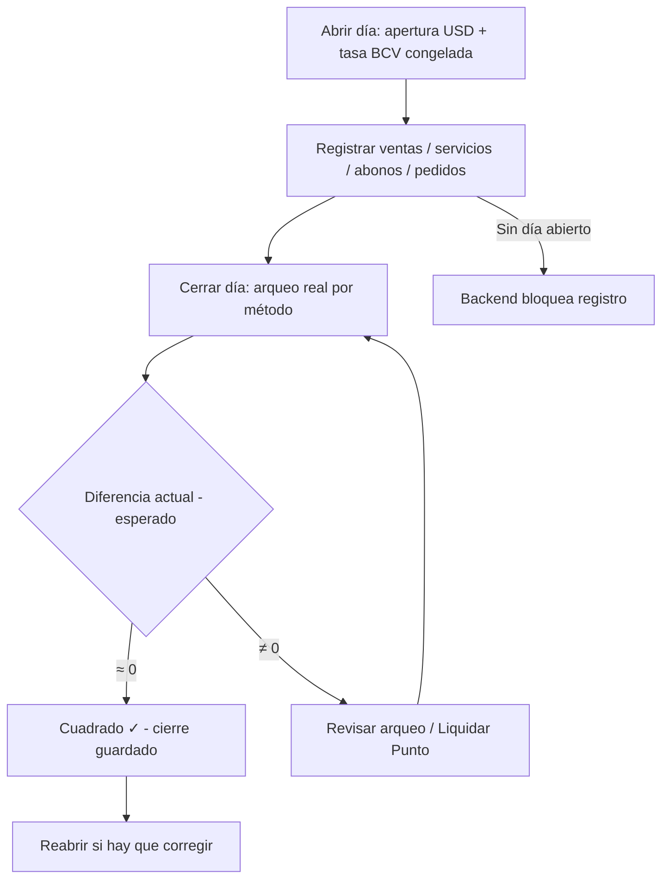
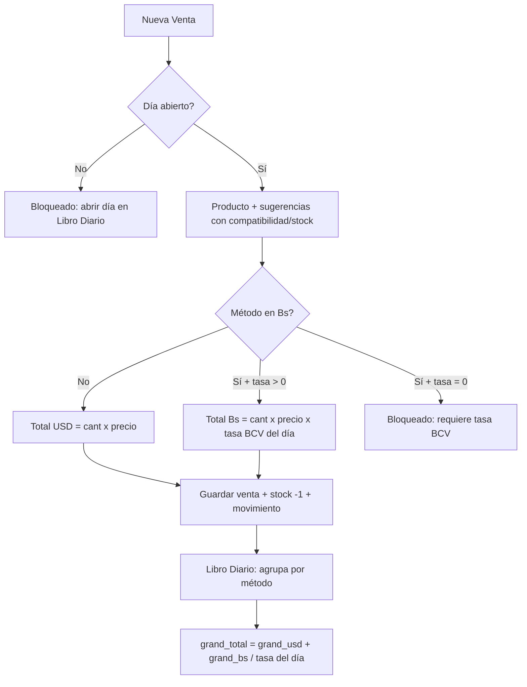
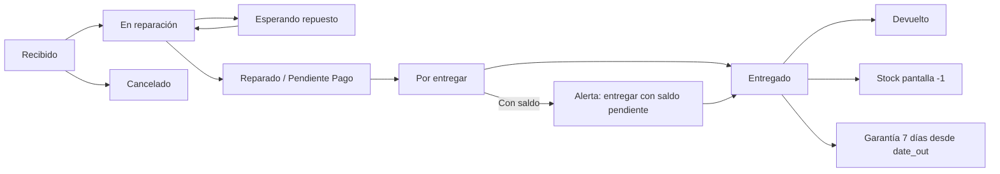
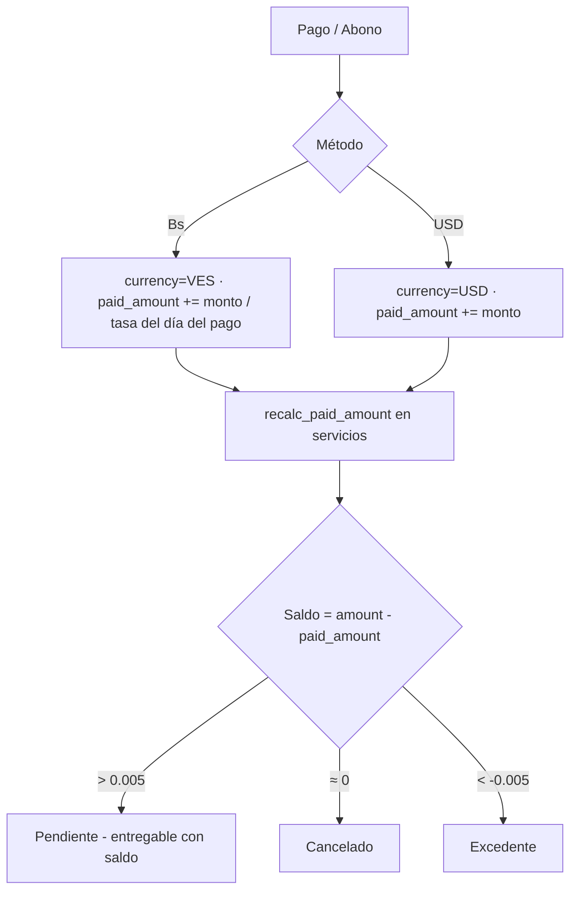
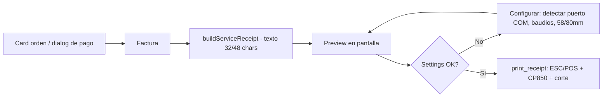

# Registro - Sistema de Servicio Técnico

Aplicación desktop **offline-first** para gestión de un servicio técnico de celulares:
inventario de pantallas y repuestos, ventas, órdenes de reparación, clientes con
historial, abonos/pagos parciales, pedidos a proveedores, **libro diario con tasa BCV**
y **factura en impresora térmica** (ESC/POS).

> 📄 Documento completo de producto (PRD): [PRD.md](PRD.md) — reglas de negocio,
> diagramas de flujo, modelo de datos y QA.

## Repositorio

- **URL:** https://github.com/shaman2527/Service_Tecnico.git
- **Rama principal:** `main`

```bash
git clone https://github.com/shaman2527/Service_Tecnico.git
```

> **Nota:** la base de datos (`registro.db`), el binario (`Registro.exe`) y las planillas
> de datos están excluidos del repo (`.gitignore`) - son datos de negocio locales.

## Stack

- **Frontend:** React 19 + TypeScript + Vite + shadcn/ui + Tailwind CSS v4 + Lucide icons
- **Backend:** Tauri 2.0 (Rust) + rusqlite (SQLite)
- **DB:** SQLite local (offline-first) - respaldo = copiar `registro.db`
- **Impresora:** ESC/POS por puerto COM (CP850) - 58/80mm

## Funcionalidades

- **Ventas:** registro con descuento automático de stock, chips de compatibilidad y
  stock visible (rojo si agotado), métodos de pago (Punto $/Bs con comisión, Zelle con
  referencia, Divisas USD, Efectivo Bs, Pago Móvil, Transferencia Bs) y **conversión
  automática a bolívares** con la tasa BCV del día abierto. Filtros por periodo y fecha,
  búsqueda por producto/cliente/cédula.
- **Servicio Técnico:** órdenes de reparación con workflow (Recibido → … → Entregado),
  **multi-trabajo por orden** (pantalla + conector + …), checklist de blindaje 10 ítems
  Sí/No, cédula y dirección del cliente, **técnico responsable** (Aldri/William),
  garantía de 7 días desde la entrega.
- **Auto-Inventario:** al entregar un servicio se descuenta 1 de la pantalla compatible
  (auto-crea el producto si no existe; devuelve stock al reabrir o borrar).
- **Abonos y pagos parciales:** por orden con Total/Abonado/Saldo, historial de pagos con
  método/referencia/notas; moneda **siempre derivada del método**; abonos Bs convertidos
  con la tasa del día del pago; se permite entregar con saldo pendiente (deuda visible).
- **Clientes:** auto-creación sin duplicados, búsqueda tolerante de cédula, historial
  completo con pagos desglosados y saldos.
- **Libro Diario (turno de caja):** un solo día abierto a la vez; apertura con efectivo
  inicial y **tasa BCV congelada** (botón Auto BCV scrapea la página oficial con curl.exe,
  fallback manual); cierre con **arqueo real por método** y diferencia calculada;
  liquidación de Punto, reapertura y **exportación CSV** por rango.
- **Pedidos a proveedor:** sugerencias de reposición, recibir pedido → **suma stock**.
- **Impresora térmica:** `list_com_ports` + `print_receipt` (ESC/POS, CP850), settings
  persistidas (puerto/baudios/58-80mm), preview de factura antes de imprimir, botones
  "Impresora" y "Factura" en cada orden y en el dialog de pago.
- **PIN de acceso:** owner/cajera con gate **fail-closed** (nunca abre sin PIN).
- **Actualizaciones automáticas:** al arrancar revisa GitHub Releases (5s, sin molestar offline); aviso con changelog → **respaldo automático** (exe anterior + copia de la DB) → instalación pasiva → **chequeo de salud** (DB, órdenes, libro diario, BCV) → si falla, **vuelve sola a la versión anterior** (watchdog + rollback). Botón "Restaurar versión anterior" en Ayuda.
- **Dashboard:** KPIs (ventas hoy/7 días, equipos en taller, ingresos), diagrama de flujo
  del workflow, top modelos, stock bajo, indicador "Sincronizado".
- **Pantallas / Inventario:** catálogo con compatibilidad en chips, movimientos de stock.
- **Centro de Ayuda:** guía completa en-app.
- **Sidebar colapsable:** `w-64` ↔ `w-16`, persistido en localStorage.

## Diagramas de flujo

### Ciclo del día (Libro Diario)



### Venta y conversión de moneda



### Workflow de la orden de servicio



### Abono / pago parcial



### Impresión de factura



## Cómo funcionan las conversiones (resumen)

1. **La moneda siempre la define el método de pago** (Bs: Pago Móvil, Efectivo Bs,
   Transferencia Bs, Punto Bs · USD: Divisas, Zelle, Punto $).
2. **Venta en Bs:** `total Bs = $ × tasa BCV del día abierto` (se guarda en Bs).
3. **Libro Diario:** separa `grand_usd` y `grand_bs` por método; el equivalente es
   `grand_usd + grand_bs / tasa` — usando la **tasa de cada día** (cierre del día →
   día abierto → último cierre), nunca se mezclan monedas crudas.
4. **Abonos:** `paid_amount` (USD) = pagos $ + pagos Bs / tasa del día del pago.
5. **Cierre:** la apertura no es venta; el arqueo compara `actual − esperado` por
   método y la diferencia combina `diff_usd + diff_bs/tasa`.

> Verificado E2E (QA 2026-08-04): venta $25 + venta Bs 7.487,90 + abonos $20 y
> Bs 22.463,70 → `grand_total = $85.00` exacto (45 + 29.951,60/748.79) y cierre
> con diferencia 0. Detalle en [PRD.md](PRD.md) §9.

## Estructura

```
registro/
├── src/                       # Frontend React
│   ├── App.tsx                # Layout + navegación + gate PIN (fail-closed)
│   ├── db.ts                  # Bridge Tauri invoke + mock browser mode
│   ├── types.ts               # Tipos compartidos
│   ├── lib/utils.ts           # Helpers: moneda, métodos, buildServiceReceipt
│   ├── components/
│   │   ├── Dashboard.tsx      # KPIs, diagrama de flujo, top modelos, stock bajo
│   │   ├── Sales.tsx          # Ventas: conversión Bs, filtros, stats
│   │   ├── Services.tsx       # Órdenes + abonos + checklist + técnicos + imprimir
│   │   ├── PaymentDialog.tsx  # Pago/Abono reutilizable + imprimir factura
│   │   ├── PrintReceiptDialog.tsx   # Preview de factura + imprimir (ESC/POS)
│   │   ├── PrinterSettingsDialog.tsx # Puerto COM, baudios, 58/80mm
│   │   ├── Inventory.tsx      # Productos, compatibilidad, movimientos
│   │   ├── Clients.tsx        # Clientes con historial y saldos
│   │   ├── Catalog.tsx        # Pantallas: catálogo + compatibilidad
│   │   ├── DailyLedger.tsx    # Libro Diario: turno, tasa BCV, arqueo, export
│   │   ├── Pedidos.tsx        # Pedidos a proveedor + reposición
│   │   ├── Help.tsx           # Centro de Ayuda
│   │   ├── ProductForm.tsx    # Form compartido producto
│   │   └── ui/                # 15 componentes shadcn
│   └── index.css              # Tailwind v4 + CSS variables
├── src-tauri/                 # Backend Rust
│   ├── src/
│   │   ├── main.rs            # Entrypoint (windows_subsystem)
│   │   ├── lib.rs             # Tauri builder + 70 comandos
│   │   ├── db.rs              # SQLite CRUD + turno + abonos + auto-inventario + settings
│   │   ├── updates.rs         # Updater: respaldo, rollback, health-check, watchdog
│   │   ├── printer.rs         # ESC/POS: list_com_ports, cp850, print_receipt
│   │   ├── bcv.rs             # Scraping tasa BCV con curl.exe (sin deps HTTP)
│   │   └── commands.rs        # Comandos Tauri
│   └── tauri.conf.json        # NSIS + resources registro.db + WebView2 embebido + updater
├── run.ps1                    # Script de ejecución
├── tools/release.ps1          # Publicar versión: bump + build firmado + latest.json + gh release
├── instaladores/              # Setup + guía para copiar a pendrive
├── PRD.md                     # Documento de producto (reglas, flujos, QA)
├── AGENTS.md                  # HARNESS: sistema de registro + Entropy Registry
└── README.md
```

## Ejecución

| Modo | Comando | Descripción |
|------|---------|-------------|
| Browser (dev) | `npm run dev` | Vite en localhost:5173. Sin backend Tauri. db.ts retorna mocks. |
| Ventana nativa (dev) | `.\run.ps1 -Dev` | Tauri dev + Vite. Backend real con SQLite. |
| Producción | `.\run.ps1 -Build` | Build release + copia a Registro.exe |
| Ejecutar release | `.\Registro.exe` o `.\run.ps1` | App standalone sin servidor |
| Instalador | `npx tauri build` | Setup NSIS con DB limpia + WebView2 embebido (~4.7MB) |

### Instalación en la tienda

1. Copiar la carpeta `instaladores\` (setup + guía) a un pendrive.
2. Ejecutar `Registro Servicio Tecnico_0.1.1_x64-setup.exe` (SmartScreen → "Más información → Ejecutar de todos modos"). **WebView2 embebido**: no necesita drivers ni internet.
3. Instala en `%LOCALAPPDATA%\Registro Servicio Tecnico\` con `registro.db` junto al exe
   (no sobreescribe una DB existente).
4. PIN inicial `1234` → cambiarlo en Libro Diario → PIN.
5. Abrir el día (efectivo inicial + Auto BCV) y configurar la impresora (Servicio Técnico → Impresora → Detectar).

### Publicar una actualización

```powershell
gh auth login                                    # una sola vez
.\tools\release.ps1 -Version 0.1.2 -Notes "Fix X, mejora Y"
```

El script corre tests, sube la versión, hace el build firmado, genera `latest.json`
con la firma y crea la GitHub Release. La app de la tienda avisa sola al arrancar
(con respaldo automático y rollback si fallara algo).

## Verificación en vivo (CDP)

La app desktop usa WebView2 — se puede inspeccionar igual que Chrome:

```powershell
$env:WEBVIEW2_ADDITIONAL_BROWSER_ARGUMENTS="--remote-debugging-port=9222"
.\Registro.exe
# luego: http://localhost:9222/json → websocket del page → Runtime.evaluate
```

Ejemplo de chequeo del backend real (dentro de la app):

```js
await window.__TAURI_INTERNALS__.invoke('get_products', { search: '', categoryId: null })
```

> **Importante:** en Tauri 2 el global es `__TAURI_INTERNALS__` — `window.__TAURI__`
> NO existe (ver Entropy Registry en AGENTS.md, entrada 2026-08-01).

## Pruebas

```bash
cd src-tauri && cargo test    # 25/25 (conversión de moneda, arqueo, garantía, técnicos, PRAGMAs, updater...)
npm run build                 # TypeScript + Vite
npx tsx tools/governance/run.ts --build-only   # harness governance
npx tsx tools/governance/run.ts --security     # harness seguridad
```

## Lecciones clave (resumen)

1. **Feature `custom-protocol` obligatoria** en Cargo.toml para que el frontend se
   embeba en el exe release. Sin ella, la app busca el dev server (ventana en blanco).
2. **Detección Tauri 2**: usar `window.__TAURI_INTERNALS__`, no `window.__TAURI__`.
3. **El build puede pasar y la app estar rota**: verificar en vivo (CDP) que la UI
   muestra filas reales y que los guardados persisten en el `.db`.
4. **La DB junto al exe** puede quedar vieja si el Copy-Item del deploy falla
   silenciosamente — verificar LastWriteTime y conteos.
5. **NO usar reqwest** en Cargo.toml (compilación eterna): el scraping BCV usa
   `curl.exe` (incluido en Windows 10+) vía `std::process::Command`.
6. **shadcn CLI roto** en este Windows (EPERM con "Configuración local"): instalar
   primitivos radix con npm y crear componentes a mano.
7. **Deadlocks de Mutex**: no llamar métodos que re-toman `self.conn.lock()` desde
   dentro de otro método que ya lo tiene (ej: `close_day` → `get_daily_totals`).
8. **`.optional()` no captura NULL de agregados** (`MAX` sobre tabla vacía devuelve
   NULL en una fila): usar `COALESCE(...,0)` (fix `next_order_num`, 2026-08-04).
9. **Gate de PIN fail-closed**: el primer invoke en arranque en frío puede fallar;
   el bridge debe reintentar y rechazar, nunca resolver como "sin PIN" (2026-08-04).

Detalles y registro completo de problemas en [AGENTS.md](AGENTS.md).
