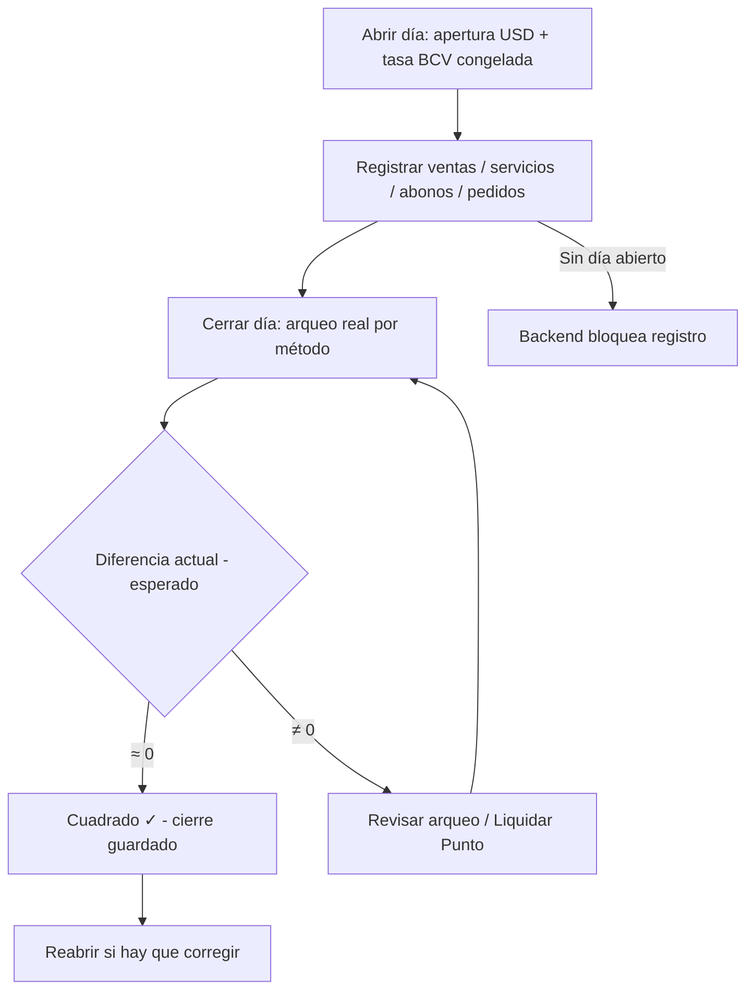
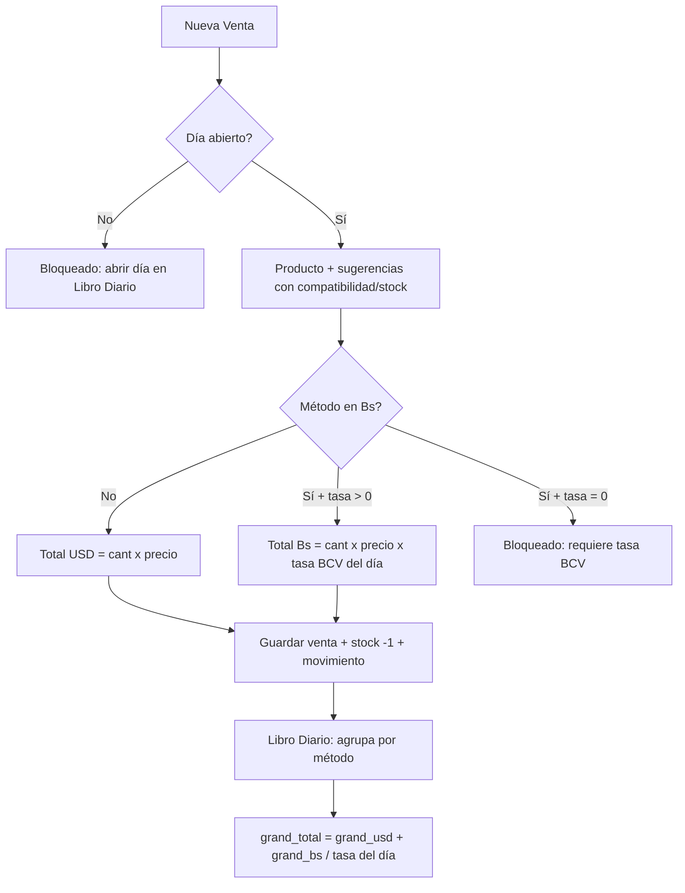
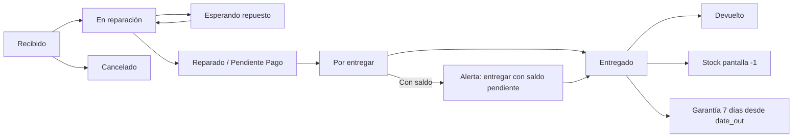
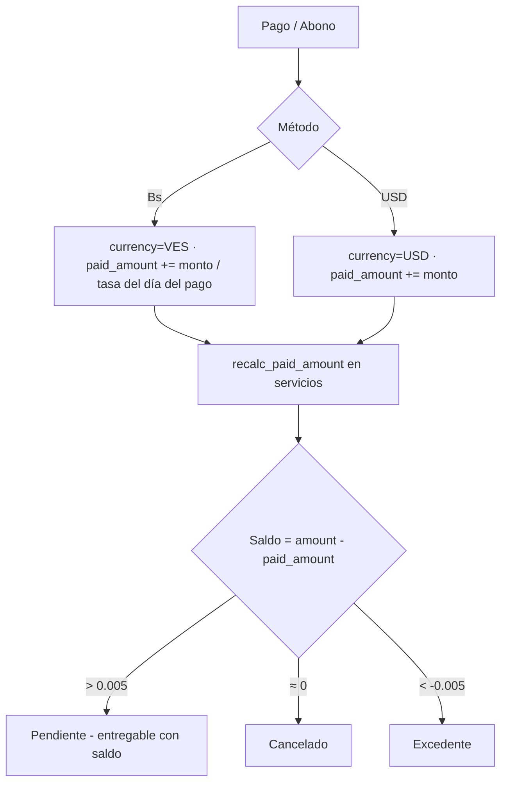
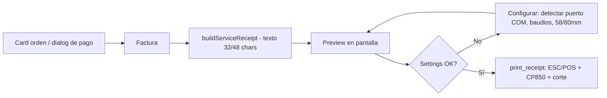

# Registro - Sistema de Servicio Técnico

Aplicación desktop **offline-first** para gestión de un servicio técnico de celulares:
inventario de pantallas y repuestos, ventas, órdenes de reparación, clientes con
historial, abonos/pagos parciales, pedidos a proveedores, **libro diario con tasa BCV**
y **factura en impresora térmica** (ESC/POS).

> 📄 Documento completo de producto (PRD): [PRD.md](PRD.md) — reglas de negocio,
> diagramas de flujo, modelo de datos y QA.
> 📋 Estado del proyecto (hecho + pendientes): [ESTADO.md](ESTADO.md)
> 🚚 **Entrega del Sprint A** (sesiones de caja, arqueo del cajón, anulación de ventas y respaldo/
> restauración — con cómo se usa, cómo se verifica y cómo se publica): [ENTREGA_SPRINT_A.md](ENTREGA_SPRINT_A.md)
> 🔎 Auditoría de entrega (con el **estado de cada hueco**): [AUDITORIA_ENTREGA.md](AUDITORIA_ENTREGA.md)

## Repositorio

- **URL:** https://github.com/shaman2527/Service_Tecnico.git
- **Rama principal:** `main`

```bash
git clone https://github.com/shaman2527/Service_Tecnico.git
```

> **Nota:** la base de datos (`registro.db`), el binario (`Registro.exe`) y las planillas
> de datos están excluidos del repo (`.gitignore`) - son datos de negocio locales.

## Stack

- **Frontend:** React 19 + TypeScript + Vite + shadcn/ui + Tailwind CSS v4 + Lucide icons
- **Backend:** Tauri 2.0 (Rust) + rusqlite (SQLite)
- **DB:** SQLite local (offline-first) - respaldo = copiar `registro.db`
- **Impresora:** ESC/POS por puerto COM (CP850) - 58/80mm

## Funcionalidades

- **Ventas:** registro con descuento automático de stock, chips de compatibilidad y
  stock visible (rojo si agotado), métodos de pago (Punto $/Bs con comisión, Zelle con
  referencia, Divisas USD, Efectivo Bs, Pago Móvil, Transferencia Bs) y **conversión
  automática a bolívares** con la tasa BCV del día abierto. Filtros por periodo y fecha,
  búsqueda por producto/cliente/cédula.
- **Servicio Técnico:** órdenes de reparación con workflow (Recibido → … → Entregado),
  **multi-trabajo por orden** (pantalla + conector + …), checklist de blindaje 10 ítems
  Sí/No, cédula y dirección del cliente, **técnico responsable** (Aldri/William),
  garantía de 7 días desde la entrega.
- **Auto-Inventario:** al entregar un servicio se descuenta 1 de la pantalla compatible
  (auto-crea el producto si no existe; devuelve stock al reabrir o borrar).
- **Abonos y pagos parciales:** por orden con Total/Abonado/Saldo, historial de pagos con
  método/referencia/notas; moneda **siempre derivada del método**; abonos Bs convertidos
  con la tasa del día del pago; se permite entregar con saldo pendiente (deuda visible).
- **Clientes:** auto-creación sin duplicados, búsqueda tolerante de cédula, historial
  completo con pagos desglosados y saldos.
- **Libro Diario (turno de caja):** un solo día abierto a la vez; apertura con efectivo
  inicial y **tasa BCV congelada** (botón Auto BCV scrapea la página oficial con curl.exe,
  fallback manual); cierre con **arqueo real por método** y diferencia calculada;
  liquidación de Punto, reapertura y **exportación CSV** por rango.
- **Pedidos a proveedor:** sugerencias de reposición, recibir pedido → **suma stock**.
- **Impresora térmica:** `list_com_ports` + `print_receipt` (ESC/POS, CP850), settings
  persistidas (puerto/baudios/58-80mm), preview de factura antes de imprimir, botones
  "Impresora" y "Factura" en cada orden y en el dialog de pago.
- **PIN de acceso:** owner/cajera con gate **fail-closed** (nunca abre sin PIN).
- **Actualizaciones automáticas:** al arrancar revisa GitHub Releases (5s, sin molestar offline); aviso con changelog → **respaldo automático** (exe anterior + copia de la DB) → instalación pasiva → **chequeo de salud** (DB, órdenes, libro diario, BCV) → si falla, **vuelve sola a la versión anterior** (watchdog + rollback). Botón "Restaurar versión anterior" en Ayuda.
- **Dashboard:** KPIs (ventas hoy/7 días, equipos en taller, ingresos), diagrama de flujo
  del workflow, top modelos, stock bajo, indicador "Sincronizado".
- **Pantallas / Inventario:** catálogo con compatibilidad en chips, movimientos de stock.
- **Centro de Ayuda:** guía completa en-app.
- **Sidebar colapsable:** `w-64` ↔ `w-16`, persistido en localStorage.

## Diagramas de flujo

### Ciclo del día (Libro Diario)


```mermaid
flowchart TD
  A[Abrir día: apertura USD + tasa BCV congelada] --> B[Registrar ventas / servicios / abonos / pedidos]
  B --> C[Cerrar día: arqueo real por método]
  C --> D{Diferencia actual - esperado}
  D -->|≈ 0| E[Cuadrado ✓ - cierre guardado]
  D -->|≠ 0| F[Revisar arqueo / Liquidar Punto]
  F --> C
  E --> G[Reabrir si hay que corregir]
  B -->|Sin día abierto| H[Backend bloquea registro]
```

### Venta y conversión de moneda


```mermaid
flowchart TD
  S[Nueva Venta] --> D{Día abierto?}
  D -->|No| BLK[Bloqueado: abrir día en Libro Diario]
  D -->|Sí| PR[Producto + sugerencias con compatibilidad/stock]
  PR --> M{Método en Bs?}
  M -->|No| US[Total USD = cant x precio]
  M -->|Sí + tasa > 0| BS[Total Bs = cant x precio x tasa BCV del día]
  M -->|Sí + tasa = 0| BSB[Bloqueado: requiere tasa BCV]
  US --> SV[Guardar venta + stock -1 + movimiento]
  BS --> SV
  SV --> LD[Libro Diario: agrupa por método]
  LD --> G[grand_total = grand_usd + grand_bs / tasa del día]
```

### Workflow de la orden de servicio


```mermaid
flowchart LR
  R[Recibido] --> TR[En reparación]
  TR --> ER[Esperando repuesto]
  ER --> TR
  TR --> RP[Reparado / Pendiente Pago]
  RP --> PE[Por entregar]
  PE --> EN[Entregado]
  R --> CA[Cancelado]
  EN --> DE[Devuelto]
  PE -->|Con saldo| AL[Alerta: entregar con saldo pendiente]
  AL --> EN
  EN --> SK[Stock pantalla -1]
  EN --> GA[Garantía 7 días desde date_out]
```

### Abono / pago parcial


```mermaid
flowchart TD
  P[Pago / Abono] --> M{Método}
  M -->|Bs| C[currency=VES · paid_amount += monto / tasa del día del pago]
  M -->|USD| U[currency=USD · paid_amount += monto]
  C --> R[recalc_paid_amount en servicios]
  U --> R
  R --> S{Saldo = amount - paid_amount}
  S -->|> 0.005| PD[Pendiente - entregable con saldo]
  S -->|≈ 0| CZ[Cancelado]
  S -->|< -0.005| EX[Excedente]
```

### Impresión de factura


```mermaid
flowchart LR
  F[Card orden / dialog de pago] --> B[Factura]
  B --> PR[buildServiceReceipt - texto 32/48 chars]
  PR --> PV[Preview en pantalla]
  PV --> SE{Settings OK?}
  SE -->|No| CF[Configurar: detectar puerto COM, baudios, 58/80mm]
  CF --> PV
  SE -->|Sí| IM[print_receipt: ESC/POS + CP850 + corte]
```

## Cómo funcionan las conversiones (resumen)

1. **La moneda siempre la define el método de pago** (Bs: Pago Móvil, Efectivo Bs,
   Transferencia Bs, Punto Bs · USD: Divisas, Zelle, Punto $).
2. **Venta en Bs:** `total Bs = $ × tasa BCV del día abierto` (se guarda en Bs).
3. **Libro Diario:** separa `grand_usd` y `grand_bs` por método; el equivalente es
   `grand_usd + grand_bs / tasa` — usando la **tasa de cada día** (cierre del día →
   día abierto → último cierre), nunca se mezclan monedas crudas.
4. **Abonos:** `paid_amount` (USD) = pagos $ + pagos Bs / tasa del día del pago.
5. **Cierre:** la apertura no es venta; el arqueo compara `actual − esperado` por
   método y la diferencia combina `diff_usd + diff_bs/tasa`.

> Verificado E2E (QA 2026-08-04): venta $25 + venta Bs 7.487,90 + abonos $20 y
> Bs 22.463,70 → `grand_total = $85.00` exacto (45 + 29.951,60/748.79) y cierre
> con diferencia 0. Detalle en [PRD.md](PRD.md) §9.

## Estructura

```
registro/
├── src/                       # Frontend React
│   ├── App.tsx                # Layout + navegación + gate PIN (fail-closed)
│   ├── db.ts                  # Bridge Tauri invoke + mock browser mode
│   ├── types.ts               # Tipos compartidos
│   ├── lib/                   # reglas PURAS (sin React), con pruebas node en tools/*_test.ts
│   │   ├── utils.ts           # moneda, métodos, fechas locales, recibo (buildServiceReceiptParts)
│   │   ├── cash-closing.ts    # F39: diferencias del arqueo y del Punto (por moneda)
│   │   ├── order-balance.ts   # F38: saldo en la moneda del cobro
│   │   ├── refund-math.ts     # F36/F42: topes por moneda y MÉTODO de la devolución
│   │   ├── payment-math.ts / payment-methods.ts / queue.ts / service-update.ts / phoneOrder.ts
│   │   ├── service-report.ts  # F44: trabajos hechos (contadores por trabajo, alcance de la lista)
│   │   ├── product-categories.ts # F65: categorías de producto (plegado, problemas, bloqueo de borrado)
│   │   └── ficha.ts / reminders.ts / service-guide.ts / screen-rules.ts / update.ts
│   ├── components/
│   │   ├── Dashboard.tsx      # KPIs, diagrama de flujo, top modelos, stock bajo
│   │   ├── Sales.tsx          # Ventas: conversión Bs, filtros, stats
│   │   ├── Services.tsx       # Órdenes + abonos + devoluciones + checklist + técnicos + imprimir
│   │   │                      #   F44: abre en «Todos los estados», contadores de trabajos y alcance
│   │   ├── RefundDialog.tsx   # Devolución: vuelve POR DONDE ENTRÓ la plata (F42)
│   │   ├── PaymentDialog.tsx  # Pago/Abono reutilizable + imprimir factura
│   │   ├── PrintReceiptDialog.tsx / PrinterSettingsDialog.tsx
│   │   ├── Inventory.tsx      # MÓDULO ÚNICO: Productos | Modelos | Repuesto por modelo | Movimientos | Ajustes
│   │   ├── inventory/         # ProductsTab, ModelsTab, ByModelTab, MovementsTab, PricesTab, StockBadge, CompatChips
│   │   ├── ModelCombobox.tsx  # Selector de modelo (lista canónica del padrón)
│   │   ├── Clients.tsx        # Clientes con historial y saldos
│   │   ├── DailyLedger.tsx    # Libro Diario: turno, tasa BCV, arqueo por moneda, devoluciones, export
│   │   ├── Pedidos.tsx        # Pedidos a proveedor + reposición
│   │   ├── Help.tsx           # Centro de Ayuda
│   │   ├── ProductForm.tsx    # Form compartido producto
│   │   └── ui/                # 23 componentes shadcn
│   └── index.css              # Tailwind v4 + CSS variables
├── src-tauri/                 # Backend Rust
│   ├── src/
│   │   ├── main.rs            # Entrypoint (windows_subsystem)
│   │   ├── lib.rs             # Tauri builder + 115 comandos
│   │   ├── db.rs              # SQLite CRUD + turno + abonos/devoluciones + auto-inventario + arqueo
│   │   ├── cache.rs           # F41: memoria corta del catálogo (Inventario rápido)
│   │   ├── catalog.rs         # Reglas canónicas marca/modelo/compat + normalizar + precios
│   │   ├── updates.rs         # Updater: respaldo, rollback, health-check, watchdog
│   │   ├── printer.rs         # ESC/POS: list_com_ports, cp850, print_receipt
│   │   ├── bcv.rs             # Scraping tasa BCV con curl.exe (sin deps HTTP)
│   │   └── commands.rs        # Comandos Tauri
│   └── tauri.conf.json        # NSIS + resources registro.db + WebView2 embebido + updater
├── run.ps1                    # Script de ejecución
├── tools/                     # Scripts del proyecto + copia embebida del harness
│   ├── verify_*.mjs           # verificaciones EN VIVO por CDP (ver «Verificación en vivo»)
│   ├── *_test.ts              # pruebas de las reglas PURAS (moneda, arqueo, devoluciones, ficha…)
│   ├── bench_inventory_ui.mjs # F41: mide en vivo lo que tarda cada pestaña en mostrar datos
│   ├── audit_inventory.mjs / snapshot_db.mjs / seed_dev_db.mjs / canonical_brands.json
│   │                          # F55: el split de modelos se espeja acá y su paridad con Rust
│   │                          #   se fija con split_fixtures.json (--gen-split-fixtures)
│   ├── release.ps1            # Publicar versión: bump + build firmado + latest.json + gh release
│   └── progress/              # history.md (append-only) · specs/ (una spec por feature) · patterns.md
├── instaladores/              # Setup + guía para copiar a pendrive
├── PRD.md                     # Documento de producto (reglas, flujos, QA)
├── ESTADO.md                  # Estado del proyecto: hecho / pendiente / por feature
├── AGENTS.md                  # HARNESS: arquitectura, decisiones, Entropy Registry, F41/F42
└── README.md
```

## Ejecución

| Modo | Comando | Descripción |
|------|---------|-------------|
| Browser (dev) | `npm run dev` | Vite en localhost:5173. Sin backend Tauri. db.ts retorna mocks. |
| Ventana nativa (dev) | `.\run.ps1 -Dev` | Tauri dev + Vite. Backend real con SQLite. |
| Producción | `.\run.ps1 -Build` | Build release + copia a Registro.exe |
| Ejecutar release | `.\Registro.exe` o `.\run.ps1` | App standalone sin servidor |
| Instalador | `npx tauri build` | Setup NSIS con la plantilla sana (`backup/plantilla_candidata.db`) + WebView2 embebido (~4.7MB) |

### Instalación en la tienda

1. Copiar la carpeta `instaladores\` (setup + guía) a un pendrive.
2. Ejecutar `Registro Servicio Tecnico_0.4.0_x64-setup.exe` (SmartScreen → "Más información → Ejecutar de todos modos"). **WebView2 embebido**: no necesita drivers ni internet.
3. Instala en `%LOCALAPPDATA%\Registro Servicio Tecnico\` con `registro.db` junto al exe
   (el catálogo inicial viaja como plantilla `registro.default.db` y solo se copia en el primer arranque — reinstalar/actualizar **nunca** toca la DB existente, verificado).
4. PIN inicial `1234` → cambiarlo en Libro Diario → PIN.
5. Abrir el día (efectivo inicial + Auto BCV) y configurar la impresora (Servicio Técnico → Impresora → Detectar).

### Publicar una actualización

```powershell
gh auth login                                    # una sola vez
node tools/make_release_template.mjs --force     # plantilla sana desde la base real (NO toca registro.db)
node tools/release_gate.mjs --db backup/plantilla_candidata.db   # 0 bloqueantes o no se publica
node tools/verify_migracion_datos.mjs            # la migración NO toca la historia del local
.\tools\release.ps1 -Version 0.4.0 -Notes "Fix X, mejora Y"
```

El script corre tests, **vuelve a correr el gate de la plantilla**, sube la versión, hace el
build firmado, genera `latest.json` con la firma y crea la GitHub Release. La app de la tienda
avisa sola al arrancar (con respaldo automático y rollback si fallara algo).

**Lo que viaja dentro del instalador:** `backup/plantilla_candidata.db`, **nunca** `registro.db`
(la base de trabajo del taller tiene órdenes, abonos y clientes reales, y el repo es público).
El generador vacía las tablas transaccionales, resetea el PIN al inicial documentado y limpia la
configuración de la máquina; `tools/release_gate.mjs` es el que impide publicar una plantilla sucia,
sin precios o con stock negativo. Las excepciones que el dueño acepte se declaran **con motivo,
fecha y topes** en `tools/release_excepciones.json` (si la situación empeora, el gate vuelve a bloquear).

**Antes de publicar, la prueba que exige el dueño** («que la actualización no dañe la base ni las
ventas registradas»):

```powershell
node tools/verify_migracion_datos.mjs --db registro.db                       # 15/15, la base real
node tools/verify_migracion_datos.mjs --db backup/registro_backup_20260804_000039.db   # base vieja con ventas
```

Toma una **copia** (VACUUM INTO, la original no se escribe), corre la migración REAL de la app
(`Database::new` → `init()` sobre la copia) y compara la historia **columna por columna** antes y
después: ventas, servicios, abonos, clientes, gastos, el arqueo de cada cierre y el stock/precio de
cada ficha por id. Los nombres propios solo pueden cambiar si el valor nuevo es **exactamente** su
Title Case (migración documentada de 2026-08-07) y las columnas resumen (saldo abonado, esperado del
cierre) se informan una por una — nunca se dan por buenas en silencio.

## Verificación en vivo (CDP)

La app desktop usa WebView2 — se puede inspeccionar igual que Chrome:

```powershell
$env:WEBVIEW2_ADDITIONAL_BROWSER_ARGUMENTS="--remote-debugging-port=9222"
.\Registro.exe
# luego: http://localhost:9222/json → websocket del page → Runtime.evaluate
```

Ejemplo de chequeo del backend real (dentro de la app):

```js
await window.__TAURI_INTERNALS__.invoke('get_products', { search: '', categoryId: null })
```

> **Importante:** en Tauri 2 el global es `__TAURI_INTERNALS__` — `window.__TAURI__`
> NO existe (ver Entropy Registry en AGENTS.md, entrada 2026-08-01).

### Verificaciones del proyecto (con la app abierta)

| Script | Qué comprueba | Notas |
|---|---|---|
| `node tools/bench_inventory_ui.mjs` | **F41** — ms hasta VER LOS DATOS en cada pestaña del Inventario (medianas, en frío) | Mide, no afirma. Pide `REGISTRO_DB` a una **copia** |
| `node tools/verify_inventario_rapido.mjs` | **F41** — que la memoria del catálogo no muestre números viejos: compara la pantalla contra la **base leída aparte** con `node:sqlite` | Escribe una ficha de prueba y la borra; **aborta si falta `REGISTRO_DB`** |
| `node tools/verify_devolucion_metodo.mjs` | **F42** — la devolución vuelve por donde entró: el backend rechaza el método que no cobró y el diálogo propone el real | Crea un pedido de prueba y lo borra |
| `node tools/verify_trabajos_hechos.mjs` | **F44** — los contadores de trabajos cuentan lo que se ve (entregados incluidos): el chip == las tarjetas al hacerle clic == el KPI, el trabajo escrito a mano tiene chip y el alcance se dice en pantalla | Escribe 3 órdenes de prueba ($0) y las borra; **aborta si falta `REGISTRO_DB`** o el día abierto; comprueba que el stock vuelva |
| `node tools/verify_tecnico_sin_asignar.mjs` | **F45/F46/F48** — el wizard crea una orden **sin técnico** y **con color** (obligatorio), la ficha pide el color y lleva el foco al selector, la observación del teléfono no bloquea, el **modal de política** aparece al guardar y se pospone, y la **señal ámbar** aparece/desaparece al asignar | Crea la orden por la UI y la borra; **aborta si falta `REGISTRO_DB`** o el día abierto |
| `node tools/verify_pantalla_agotada.mjs` | **F47/F48** — pantalla **agotada**: aviso en rojo con el texto del inventario, confirmación marcada por defecto, «Actualizar Servicio» habilitado con el estado Entregado, y sin color el paso no avanza | **No guarda nada** (el stock no se mueve, verificado contra la base); **aborta si falta `REGISTRO_DB`** |
| `node tools/verify_descuento.mjs` | **F49** — la tarjeta con «Descuento» (y sin «Cerrar»), el diálogo que aplica el descuento desde el precio de lista, y **la factura con PRECIO / DESCUENTO / TOTAL** | Crea una orden de $30, le aplica y le quita el descuento, comprueba por IPC y **borra** la orden; **aborta si falta `REGISTRO_DB`** |
| `node tools/verify_models_tab.mjs` | Pestaña Modelos: KPIs, filtros, orden de 3 estados, ficha por categoría | `EXPECT_PHONES`/`EXPECT_REVIEW` son la expectativa independiente |
| `node tools/verify_orden_columnas.mjs` | **F51** — orden por columnas en Inventario → Productos: cada encabezado reordena de verdad, con ciclo asc→desc→sin orden y `aria-sort` | **Solo lectura**: compara el orden de la pantalla contra el **mismo orden calculado sobre la base** (`node:sqlite`) |
| `node tools/verify_uso_modelos.mjs` | **F50** — «lo que uso»: el check por producto y por modelo cambia SOLO `in_use` (stock/precio/compat intactos, contra la base), el código `P-…`/`M-…` se ve y se busca (con guion y sin guion), los filtros «Solo lo que uso» / «Lo que NO uso», y el formulario de servicio ofrece solo lo marcado (con «Ver todos» y el aviso «sin usar») | Escribe SOLO los checks y los **restaura**; **aborta si falta `REGISTRO_DB`**; compara siempre contra la base leída aparte |
| `node tools/verify_aviso_no_tapa.mjs` | **F54** — el aviso de política **no tapa la factura** ni se traga los clics: con el comprobante abierto no se dibuja (queda en la cola), el clic sobre la factura cae dentro de la factura, al cerrarla el aviso vuelve y **tocar el mensaje lo quita** (y la ✕ también) | Entrega UNA orden de prueba por la UI **sin cobrar** y la borra; **aborta si falta `REGISTRO_DB`** |
| `node tools/verify_screen_brand_gate.mjs` | Gate de marca de la pantalla en el servicio (OTRA marca nunca se auto-elige) | Solo lectura |
| `node tools/verify_tecnico_y_fecha_pago.mjs` | F34/F35/F36/F38/F39: técnico rápido, fecha del pago, saldo en Bs. y las dos columnas del arqueo | Aborta si no hay turno abierto |
| `node tools/verify_categorias_producto.mjs` | **F65** — las categorías de producto dejan de ser una lista cerrada: se crea una desde el formulario del producto (y queda elegida y **guardada en la base**), el filtro de Productos la ve al instante, un nombre que ya existe **no** crea una gemela (avisa y ofrece usarla), **Escape cierra el panel y no el formulario**, en Ajustes se ve el uso real, se **corrige** el nombre y se **elimina** la vacía — y las del padrón de teléfonos o con productos **no se pueden borrar** | Escribe en la tabla `categories` y limpia; **aborta si falta `REGISTRO_DB`**; compara siempre contra la base leída aparte |
| `node tools/verify_precio_pantalla.mjs` | **F67** — el precio del repuesto: elegir la pantalla TOMA su precio de venta (y el del modelo sigue disponible **a un toque**, y no se ofrece cuando el monto ya es el suyo), el descuento del efectivo no se aplica sobre un monto escrito a mano, y la orden guarda `amount`/`discount_amount`/`screen_product_id` | Crea una orden, la guarda y la **borra**; **aborta si falta `REGISTRO_DB`** |
| `node tools/verify_sesiones_caja.mjs` | **F68** — acceso por persona con PIN propio, la caja ve todo el mostrador y **vende**, la caja **no** ve los movimientos de otras sesiones (lo impone el backend), 5 comandos del dueño rechazados por IPC y el autor de cada movimiento en el libro | Crea la persona «Caja 1» si falta y borra sus ventas de prueba; **aborta si falta `REGISTRO_DB`** |
| `node tools/verify_arqueo_f69.mjs` | **F69** — el arqueo del cajón: el desglose (cobrado + fondo − gastos pagados del cajón) es el MISMO número que usa `close_day`, todas las líneas nacen «sin contar», cerrar sin contar se rechaza y el día **sigue abierto** en la base, un conteo distinto baja el semáforo de esa moneda, la caja **no** tiene Cerrar Día/Gastos/Salud/Personas, utilidad/capital/respaldo rechazados por IPC y el catálogo **sin costo** para la caja | Anota un gasto del cajón y un fondo de prueba y los **deshace** al terminar (contra-asiento incluido); **aborta si falta `REGISTRO_DB`** o el día abierto; corre sobre DOS copias (una con el turno abierto de hoy y otra de otro día) |
| `node tools/verify_anular_venta.mjs` | **F70** — anular una venta: se vende, se anula con motivo y se comprueba en la **BASE** el stock devuelto, el movimiento de inventario de ENTRADA, el contra-asiento con autor/motivo y que el arqueo del día baje **exactamente** el monto; la fila queda tachada con su motivo, la caja **no** tiene el botón (y el IPC se rechaza), y el formulario de venta avisa cuando la ficha no tiene precio | Crea ventas de prueba por IPC y las **saca** al terminar; **aborta si falta `REGISTRO_DB`** o el día abierto |
| `node tools/verify_f87_carga_catalogo.mjs` | **F87** — la carga masiva rediseñada, con **el archivo real del dueño** (`tools/prueba-carga-catalogo.csv`, 83 filas): el paso «Revisar» **sin scroll lateral** (medido: caja = tabla, desborde 0 a 1366×715 y a 1200) y **apilado** por debajo de 1100, las **83 filas** repartidas en sus dos pestañas (69 «Ya existen» + 14 «Nuevos»), los **71 códigos `P-####`** que trae el archivo recuperados **en pantalla** (ninguno perdido, ninguno inventado; las otras 12 filas no tienen código en su Excel), los **4 avisos de compatibilidad de verdad** visibles sin arrastrar (antes 25, casi todos falsos: el de `Infinix Gt 20 Pro INCELL` desaparece y el de `Tecno Spark 20 Pro ORIGINAL` se queda), y el modo del stock + el resumen + el botón de aplicar intactos | **Solo lectura** (usa la vista previa; NO aplica la carga); **aborta con exit 2 si el registro de arranque no coincide** |
| `node tools/verify_f88_carga_compatibilidad.mjs` | **F88** — la carga masiva **se aplica de verdad** y deja la data corregida: antes se frenaba sola con «el código «P-1031» ya es de la ficha #1031» (el sistema le regalaba a la primera ficha nueva el código que el archivo traía para otra pantalla); ahora el código automático no le roba el código a ninguna fila, dos códigos distintos no son la misma pantalla (`P-0053` no se pierde), el padrón asocia la pantalla a **los 8 teléfonos** de su lista, y el paso «Revisar» muestra **la compatibilidad de cada fila con su conteo de teléfonos** (y distingue «del modelo» de «se conserva la que ya tenía») | **ESCRIBE**: aplica su archivo (`tools/prueba-carga-catalogo.csv`) sobre una **copia** |
| `node tools/verify_f90_ficha_compatibilidad.mjs` | **F90** — la ficha del teléfono vive del **campo de compatibilidad del producto**: por el camino real del formulario (Productos → lápiz → **la lista de modelos**), quitar un teléfono hace **desaparecer** el repuesto de la ficha del teléfono (6 → 5) y volver a agregarlo lo hace **reaparecer** (5 → 6); al terminar deja la compatibilidad como estaba | **ESCRIBE** (y devuelve el estado). Correr sobre una **copia** |
| `node tools/verify_f91_compat_modelos.mjs` | **F91** — la compatibilidad se edita con la **LISTA DE MODELOS**: el editor del producto **ya no tiene campo de texto** (un chip por teléfono con su ✕ + buscador del padrón), quitar un teléfono lo saca de **su ficha** en Modelos, agregarlo desde el padrón lo devuelve, y **crear** uno que no existía lo deja en el padrón con su ficha; la prueba no deja residuos | **ESCRIBE** (y devuelve el estado). Correr sobre una **copia** |
| `node tools/verify_f92_fecha_pago_cierre.mjs` | **F92** — la **fecha del pago** ya no se bloquea por el cierre: un cobro fechado en un día **cerrado** entra en esa caja y **su cierre se actualiza** (el esperado cambia y el **arqueo contado NO**), corregir la fecha de un pago que está en un día cerrado se permite, y el **dinero se guarda con 2 decimales** (Bs. 12.345,67 se conserva; antes 12.346) | **ESCRIBE** (y borra lo que crea). Correr sobre una **copia** |
| `node tools/verify_f93_red_compat.mjs` | **F93** — la **red de compatibilidad se sincroniza**: quitar un teléfono de una pantalla cambia **las dos fichas** (la del que queda y la del retirado) y volver a agregarlo la rearma; un producto de otra red no se toca; las **variantes** ya no parten el teléfono (una ficha por teléfono, sus pantallas dentro y el desplegable del servicio ofreciéndolas) | **ESCRIBE** (y devuelve el estado). Correr sobre una **copia** |
| `node tools/abrir_dia.mjs` | Abre el **turno de caja** en la base que está usando la app (por `open_day`, la misma vía del frontend): lo necesitan las verificaciones que exigen un día abierto (cobros, cierres, precios de pantalla) cuando la copia de trabajo no lo tiene | **ESCRIBE** (abre el día). Solo sobre una **copia** |
| `node tools/estado_taller.mjs` | Foto de la **base del taller** (la del acceso directo) **sin abrir la app**: productos, stock, teléfonos del padrón, la compatibilidad de una ficha y ventas/servicios/turnos. Sirve para comprobar que una prueba no tocó la base real | **Solo lectura** |
| `node tools/verify_f89_pantallas_del_modelo.mjs` | **F89** — el desplegable **«Pantalla a instalar»** del servicio ofrece **solo las pantallas de ESE modelo** (la compatibilidad que lo nombra): medido, para «Spark 7 Pro» ya no aparecen `Google 7 Pro`, `Realme 7 Pro` ni `Redmi Note 7` (que entraban por coincidencia parcial), y **tocar cualquiera de los teléfonos de la red devuelve exactamente el mismo conjunto de pantallas** | **Solo lectura** (consulta el backend y mira la UI); no escribe nada |
| `node tools/verify_f86_carga.mjs` | **F86** — la carga masiva que hace lo que dice: el asistente elige **modo del stock** (sumar/reemplazar), avisa cuando **no reconoce la columna de stock** (con los nombres reales del archivo) y cuando la compatibilidad no incluye al modelo, dice el **stock final real** por fila, y una ficha en **faltante (−60) + 30 del archivo queda en 0** (no en −30) | **ESCRIBE**: aplica una carga de prueba (reproduce el faltante con un movimiento real de salida). **Correr SIEMPRE sobre una copia** |
| `node tools/audit_modelos.mjs` | **F86** — «para cada modelo revisá si tiene que arreglarlo»: fichas con modelo y sin compatibilidad, fichas cuya lista **ignora su propio modelo**, teléfonos nombrados que no están en el padrón, teléfonos **sin ningún repuesto** y los faltantes reales | **Solo lectura** (`--db <copia>`); compara por modelo/nombre/**alias** (no por el modelo pelado: el padrón guarda el canónico «iphone 11 pro» y la compatibilidad «Apple 11 Pro») |
| `node tools/verify_inventario_responsive.mjs` | **F85** — el inventario **sin scroll lateral** a 1200/1366/1920 y **apilado** por debajo de 1024 (una ficha por repuesto, con el rótulo de cada dato), más los contratos que leen las otras pruebas (`td[2]` = categoría, `[data-variant]` con la variante exacta, el «en uso» como `role="switch"`) | **Solo lectura** (mira el DOM y cambia el **tamaño de la ventana** por CDP con `setViewport`); **aborta si el inventario está vacío** |
| `node tools/verify_respaldo.mjs` + `verify_respaldo2.mjs` | **F71** — respaldos: el botón en Ayuda, el estado y la carpeta, un respaldo REAL en disco (con `quick_check` y las MISMAS filas que la base viva), «Respaldar ahora», la restauración que rechaza un archivo que no es respaldo y deja copia de seguridad + marcador; **parte 2 (después de reiniciar)**: la base volvió al respaldo y la caja no puede respaldar ni restaurar | Escribe los respaldos en `backup/respaldos` de la **copia** y restaura uno; **aborta si falta `REGISTRO_DB`** |
| `node tools/verify_recordatorios.mjs` · `verify_servicio_cierre.mjs` · `verify_cola_entregas.mjs` · `verify_metodos_en_cobros.mjs` · `verify_wizard_metodos.mjs` | F30–F33: recordatorios, asistente de cierre, cola de entregas, métodos de pago | Escriben y limpian sus órdenes de prueba |
| `node tools/verify_carga_csv.mjs` | **F78** — la carga masiva en CSV: el asistente con sus **2 pestañas** (nuevos vs existentes), el **diff** «hoy → queda», el stock que **SUMA** (`3 → 13`, nunca pisa), la categoría nueva (id **no** reservado por el padrón de teléfonos), los movimientos con motivo «Carga masiva (CSV)» y el respaldo previo — todo contra la **base leída aparte** — más un archivo con error que **bloquea** la carga | Entra como dueño por el selector de personas, crea productos/categoría/movimientos de prueba y los **borra**; **aborta si falta `REGISTRO_DB`** |
| `node tools/verify_cobro_en_wizard.mjs` | **F79** — COBRAR DENTRO DEL WIZARD: el botón de pago vive en el **bloque del color** del equipo (con el método de pago arriba, sin duplicar), sin los datos **avisa y no guarda**, con los datos **crea la orden** y abre **el mismo** «Pago / Abono» con el método del equipo, el abono de $1 queda en la **base**, el paso 2 muestra «Cobrado $1.00 · saldo $29.00», el guardado final **ACTUALIZA** (monto 30 → 40, abono intacto) **sin duplicar** la orden, los recordatorios siguen saliendo al cerrar, y en **edición** el mismo botón cobra sin guardar nada y el cierre imprime el comprobante de la orden cobrada | Crea una orden por la UI y la **borra** con su abono y su cliente de prueba; **aborta si falta `REGISTRO_DB`** o el día abierto |
| `node tools/verify_editar_producto_wizard.mjs` | **F80** — EL LÁPIZ DE LA FICHA EN EL WIZARD: el lápiz en cada fila de la pantalla (y en el buscador libre, y solo con la llave del dueño), el atajo con los valores REALES de la ficha que **no guarda sin cambios**, la edición de precio+stock que queda en la base **con el resto de la ficha intacto**, la fila que se recarga con el precio nuevo, el monto **sin tocar** y el monto **tecleado** que NO se mueven (el precio nuevo se OFRECE, regla F67), el **alta como PRIMER diálogo de la sesión** que nace con la categoría del padrón (verificada en la base) y **aparece en la lista**, el **duplicado** avisado y bloqueado, el lápiz del buscador que edita + agrega el modelo a la compatibilidad y refresca la fila del resultado **y** la de la pantalla elegida, y «Ficha completa» que abre el formulario de Inventario **sin Eliminar** y cuyo Cancelar vuelve al atajo con lo escrito intacto **sin guardar nada** | Crea una pantalla de prueba y **edita fichas reales** (precio, stock y compatibilidad) que **restaura** al terminar, deja el catálogo con la **misma cantidad de fichas** y **recarga la app** (no deja diálogos abiertos); **aborta si falta `REGISTRO_DB`** |

**Receta:** abrir la app con la copia (`$env:REGISTRO_DB="…\backup\perf_app.db"` + el puerto 9222), pasar el PIN, correr el script. Los scripts **esperan condiciones** (nunca duermen a ojo) y varios **abortan** si falta el día abierto o la variable de la copia.

## Pruebas

```bash
cd src-tauri && cargo test --release --lib     # 133/133 (+7 manuales ignorados)
npm run build                                  # TypeScript + Vite
npx tsc -b && npx oxlint src                   # 0 errores

# reglas PURAS (node, sin app abierta):
node tools/pos_cuadre_test.ts        # arqueo por moneda (F39)            66/66
node tools/refund_math_test.ts       # topes y MÉTODO de la devolución    45/45
node tools/payment_math_test.ts      # cuentas de los cobros             595/595
node tools/receipt_acuerdo_test.ts   # recibo (montos, descuento, anchos)   74/74
node tools/ficha_test.ts             # ficha de ingreso (F33/F48)           75/75
node tools/reminders_test.ts         # recordatorios (F32)                 38/38
node tools/service_guide_test.ts · queue_test.ts (npx tsx) · local_date_test.ts (npx tsx) · method_picker_test.ts (npx tsx)
node tools/service_report_test.ts    # trabajos hechos / contadores (F44)   68/68
node tools/policy_queue_test.ts      # cola del modal de política (F46)     13/13
node tools/discount_test.ts          # descuento del servicio (F49)         21/21
node tools/category_rules_test.ts    # categorías de producto (F65)         42/42
node tools/screen_price_test.ts      # precio del repuesto / de la pantalla (F67) 45/45
node tools/session_test.ts           # qué ve y qué toca cada rol (F68)     42/42
node tools/arqueo_test.ts            # arqueo del cajón: fondo + gastos (F69) 49/49
node tools/void_sale_test.ts         # anular una venta (F70)             35/35
node tools/backup_test.ts            # respaldos: estado y restaurar (F71) 37/37
node tools/wizard_cobro_test.ts      # cobro dentro del wizard (F79)     52/52
node tools/product_edit_test.ts      # editar la ficha del repuesto (F80)  66/66
node tools/verify_editar_producto_wizard.mjs  # EN VIVO (CDP): el lápiz en el wizard (F80)  54/54
node tools/verify_cobro_en_wizard.mjs  # EN VIVO (CDP): cobrar en el wizard (F79)  81/81
```

## Lecciones clave (resumen)

1. **Feature `custom-protocol` obligatoria** en Cargo.toml para que el frontend se
   embeba en el exe release. Sin ella, la app busca el dev server (ventana en blanco).
2. **Detección Tauri 2**: usar `window.__TAURI_INTERNALS__`, no `window.__TAURI__`.
3. **El build puede pasar y la app estar rota**: verificar en vivo (CDP) que la UI
   muestra filas reales y que los guardados persisten en el `.db`.
4. **La DB junto al exe** puede quedar vieja si el Copy-Item del deploy falla
   silenciosamente — verificar LastWriteTime y conteos.
5. **NO usar reqwest** en Cargo.toml (compilación eterna): el scraping BCV usa
   `curl.exe` (incluido en Windows 10+) vía `std::process::Command`.
6. **shadcn CLI roto** en este Windows (EPERM con "Configuración local"): instalar
   primitivos radix con npm y crear componentes a mano.
7. **Deadlocks de Mutex**: no llamar métodos que re-toman `self.conn.lock()` desde
   dentro de otro método que ya lo tiene (ej: `close_day` → `get_daily_totals`).
8. **`.optional()` no captura NULL de agregados** (`MAX` sobre tabla vacía devuelve
   NULL en una fila): usar `COALESCE(...,0)` (fix `next_order_num`, 2026-08-04).
9. **Gate de PIN fail-closed**: el primer invoke en arranque en frío puede fallar;
   el bridge debe reintentar y rechazar, nunca resolver como "sin PIN" (2026-08-04).
10. **PLATA — la devolución vuelve POR DONDE ENTRÓ (F42, 2026-09-17).** El método del
    FORMULARIO de una orden es *sólo lo que se esperaba cobrar*: proponerlo como método de
    una devolución metió la salida en un bucket que nunca cobró (Punto en **−Bs. 1.697**) y
    la plata que salió del cajón no aparecía en ninguna pantalla del arqueo. El método sale
    de los **movimientos**, el gate está también en el backend (fail-closed) y los métodos
    de cajón pueden pagar la devolución, con aviso.
11. **Un esperado ≠ 0 NUNCA se esconde (F42).** Las columnas/filas del Libro y del cierre se
    dibujaban con `> 0`: una devolución que deja un método en 0 o negativo **desaparecía**.
    La condición es `|x| > tolerancia`, y el día muestra aparte cuánto se **devuelto**.
12. **Medir antes de optimizar (F41).** En release y sobre una copia: el «problema» del
    Inventario no era la tabla (2-5 ms) sino cuatro cálculos derivados del catálogo repetidos
    en cada pestaña (118 + 140 + 113 + 240 ms) y un rebote de 200 ms en TODA consulta. El
    bench queda en `tools/bench_inventory_ui.mjs`.

Detalles y registro completo de problemas en [AGENTS.md](AGENTS.md).

#### F45–F48 (2026-09-20) — alta guiada y avisos que no bloquean
- **F45 — Técnico «Sin asignar» por defecto:** al crear una orden no se prellena ningún técnico (se quitó el `last_technician` de localStorage) y la orden se guarda sin él; la tarjeta en taller muestra el chip ámbar **«Falta asignar técnico»** (`data-needs-tech`) que abre el selector rápido. Regla pura `needsTechnician` (`lib/service-guide.ts`).
- **F46 — Recordatorio de política como MODAL CENTRADO** (`PolicyModal.tsx` + `policy-queue.ts`, reemplaza `PolicyToast.tsx`): velo suave, tarjeta con tinte por tono, acciones a un toque y **«Después»**; bloquea la pantalla, nunca los datos; dedupe por aviso+orden; Escape solo si no hay otro diálogo encima. Test puro `tools/policy_queue_test.ts`.
- **F47 — Pantalla AGOTADA: aviso en rojo, predeterminado y SIN bloquear** (`screenOk` ya no pide confirmación; `outOfStockChoice` detecta el caso; la confirmación arranca marcada; el asistente de cierre pasó el aviso a rojo). Sigue siendo obligatorio ELEGIR la pantalla cuando hay opciones.
- **F48 — Alta guiada:** el **color del equipo es obligatorio** (ficha en `falta`, paso del wizard, guardado), la ficha agrega **observaciones que no bloquean** («Falta el número de teléfono del cliente», sin técnico) con `data-ficha-nota`, y **«Ir al campo» lleva el FOCO** al control del dato (`data-ficha-target`). Colores nuevos: **Lila** y **Marrón**.
- **En vivo:** `node tools/verify_tecnico_sin_asignar.mjs` (F45+F46+F48, 30/30) · `node tools/verify_pantalla_agotada.mjs` (F47+F48, 16/16, no guarda nada: el stock no se mueve) · `verify_recordatorios` 65/65.

#### F49 (2026-09-20) — El «Cerrar» de la tarjeta es ahora «Descuento» (y sale en la factura)
- **La tarjeta:** se quitó el botón **«Cerrar»** y va **«Descuento»** (`data-discount="<id>"`). El asistente de cierre sigue a un toque desde **«Cerrar entrega»** de la barra (o F4 → elegir la orden).
- **Diálogo de descuento** (`DiscountDialog.tsx`): abre con el descuento actual, muestra PRECIO/DESCUENTO/TOTAL en vivo, chips $1/$2/$3/$5/$10 + «Sin descuento», avisa cómo queda el saldo si ya hay abonos, y guarda con `updateOrderKeepingFields` (no pisa nada más). **No toca la caja.**
- **Regla pura** `src/lib/discount.ts` (+ `tools/discount_test.ts` 21/21): el precio de lista es `amount + discount_amount` y el descuento nuevo se calcula desde ahí (nunca dos veces), acotado a `[0, precio]`.
- **La factura** imprime `PRECIO` / `DESCUENTO` / `TOTAL` (principal y talón) **solo cuando hay descuento**; sin descuento el papel queda idéntico.
- **En vivo:** `node tools/verify_descuento.mjs` (15/15) · `receipt_acuerdo_test.ts` 74/74 · regresiones actualizadas al botón nuevo: `verify_servicio_cierre` 18/18, `verify_recordatorios` 65/65, `verify_metodos_en_cobros` 16/16.

#### F51 (2026-09-20) — Inventario: orden por COLUMNAS en Productos
- Clic en el encabezado: **asc → desc → sin orden**, con flecha y `aria-sort`; la paginación vuelve a la página 1. Server-side, con las **dos claves** de cada columna (nombre, categoría, marca, modelo, variante, precio, costo, stock, mín) y las viejas del desplegable conservadas.
- **Dos defectos reales cazados al verificar:** faltaba la clave inversa de varias columnas (`costo_desc`…) → el segundo clic no hacía nada (ahora hay **test Rust** `test_product_sort_keys_are_valid` con las 23 claves); y las columnas de Precio/Costo **desaparecían según la página** (con su encabezado para ordenar) → ahora se muestran siempre, en columnas separadas.
- **En vivo:** `node tools/verify_orden_columnas.mjs` (12/12, solo lectura) comparando el orden de la pantalla **contra la base leída aparte**. `cargo test --lib` 134/134.

#### F50 (2026-09-20) — Inventario: «lo que uso» (el check) + códigos de referencia
- Pedido del dueño: «no lo usa todo; un check con su número de cada producto o modelo… ésos son los que le van a aparecer cuando registra un servicio, así la búsqueda es más rápida».
- **Dos columnas nuevas en cada tabla** (`products.in_use` / `products.code`, `phones.in_use` / `phones.code` / `phones.default_product_id`), **al final** del orden físico. La migración se hace **por tabla y por columna** (probando cada una): en una base nueva la tabla `phones` nace **después** del bloque de `products`, así que el `ALTER` de `phones` fallaba en silencio y la base quedaba a medias («no such column: code»).
- **Seed** una sola vez: queda **en uso lo que tiene stock** (es lo que el taller tiene en el cajón) y se apaga el resto; **códigos** `P-0001` / `M-0001` completados siempre, sin pisar los que ya están. La misma regla se aplica a los productos nuevos. El dueño prende/apaga a mano lo que quiera.
- **El check es ANGOSTO:** `set_product_in_use`, `set_phone_in_use`, `set_phone_use_all` (transaccional: el teléfono **y sus repuestos**, con la misma unión clave+alias del padrón), `set_product_code`, `set_phone_code`, `set_phone_default_product`. **Nunca** tocan stock, precios, movimientos ni compatibilidad.
- **Inventario → Productos:** columna «En uso» ordenable, filtros **«Solo lo que uso»** / **«Lo que NO uso (apagado)»**, y la búsqueda encuentra por **código** (con guion y sin guion). **Inventario → Modelos:** el código `M-…` y el check por fila.
- **Registro de servicio:** el selector de modelo ofrece **solo lo que está en uso**, con el interruptor **«Ver todos»** (persistido en `localStorage`) y el aviso **«sin usar»** en lo apagado. La lista de **pantallas** de un modelo **no** se filtra: apagar una ficha no puede dejar al taller sin poder elegir el repuesto que tiene que instalar (decisión revisada frente a la spec).
- **El inventario sigue descontando:** test `test_in_use_never_stops_the_inventory_deduction` (una pantalla apagada a mano que se elige y se entrega **se descuenta**, y al reabrir vuelve a la MISMA ficha).
- **En vivo:** `node tools/verify_uso_modelos.mjs` (35/35) · `cargo test --lib` **136/136** · regresiones: `verify_orden_columnas` 12/12, `verify_trabajos_hechos` 26/26, `verify_smoke_integral` 110 comprobaciones. `tsc -b` 0 · `oxlint` 0 errores · `harness_security` PASS · `harness_truth` PASS.

#### F54 (2026-09-20) — El aviso de política no tapa la factura (y se quita con un toque)
- Pedido del dueño: «al finalizar el mensaje que sale de tlf y otro mensaje **no me deja ver la factura la orden**; le doy clic al mensaje y **no se quita**».
- **Qué pasaba (medido en vivo):** al entregar con «Imprimir la orden al cerrar», el asistente de cierre encola los avisos de política **y** abre la factura en el mismo paso. El modal centrado (F46) traía un velo a `z-[100]`, **por encima** de los diálogos (`z-50`): tapaba la factura y el **primer clic** (el de «Cerrar entrega» o el de la factura) lo consumía el velo — había que tocar dos veces. Y en la tarjeta solo cerraban los botones, el velo o Escape (con un diálogo abierto, Escape se ignora a propósito).
- **Arreglo:** (1) **el aviso no se dibuja mientras hay un diálogo a la vista** — queda en la cola y sale apenas se cierra (no se pierde ninguno) — y el velo pasa a `z-40`, por debajo de los diálogos; (2) **un toque en cualquier parte de la tarjeta lo cierra** (equivale a «Después»: no anota nada) más una **✕** visible; los botones de acción siguen igual; (3) nada de plata ni stock: el trabajo ya estaba guardado.
- **En vivo:** `node tools/verify_aviso_no_tapa.mjs` (14/14, con una **entrega real** sin cobro y su limpieza) · regresión `verify_recordatorios.mjs` **67/67** (los dos chequeos que exigían la conducta vieja se reescribieron a la nueva).

#### F52 (2026-09-20) — Inventario: vista «Por modelo» (una fila por teléfono, con sus variantes adentro)
- **Conmutador de vista** en Productos: **«Lista (ficha por ficha)»** | **«Por modelo (una fila por teléfono)»** (`data-view` / `data-view-state`).
- **Una fila por TELÉFONO del padrón** (`ProductsByModel.tsx`): código `M-…`, nombre, marca, **chips de variante adentro** (no como modelos distintos), cantidad de repuestos, **stock total**, **rango de precios**, el check **«lo uso»** del modelo y su **pantalla de referencia**.
- **Se despliega**: sus repuestos con **código, variante, precio, costo, stock** y su propio check, más el botón para **fijar/quitar la pantalla de referencia** del modelo (lo que el registro de servicio va a auto-seleccionar).
- **La variante es COLUMNA** (ordenable) y **FILTRO por familia** en la lista plana: pedir «OLED» trae OLED y «OLED Con Marco» (161 fichas en el catálogo real).
- **Reglas canónicas** en `catalog.rs` (`variant_family`, `variant_rank`, `sort_variants`) y su gemela en SQL (`VARIANT_FAMILY_SQL`) con **test de paridad**; puras en `src/lib/variant.ts` (+ `tools/variant_test.ts` 22/22).
- **Bug real cazado en vivo:** el detalle del teléfono no traía `code`/`in_use` de cada repuesto (la lista de columnas del SELECT se había quedado corta y los `unwrap_or` lo tapaban) → el despliegue mostraba todo «en uso» y sin código. Arreglado y fijado por test.
- **En vivo:** `node tools/verify_por_modelo.mjs` (27/27, contra la base) · `cargo test --lib` **139/139** · regresiones: `verify_orden_columnas` 12/12, `verify_uso_modelos` 35/35, `verify_trabajos_hechos` 26/26, `verify_aviso_no_tapa` 14/14, `verify_smoke_integral` **110/110**.

#### F53 (2026-09-20) — Un solo nombre por modelo, pantalla de referencia y duplicados
- **Split del padrón:** `catalog::split_model_models` parte el texto cuando tiene **2+ códigos** («Samsung A70 A705» → **A70** + **A705**; «K20 Plus MP260» → «K20 Plus» + «MP260»); NO parte «Redmi Note 11», «A06 4G» ni «Galaxy S21 Ultra 5G». La pantalla queda **compatible con los dos** (no se reescribe la compatibilidad del repuesto).
- **Migración guiada con vista previa** en **Inventario → Ajustes**: `preview_phone_split` calcula el informe *ejecutando el rebuild en una transacción que se revierte* (real: 1135 → 1205 teléfonos, 201 aparecen, 131 nombres pegados desaparecen) y `apply_phone_split` respalda la base, saca del texto la variante que falte, numera los nuevos (`M-…`) y los marca «en uso». **Idempotente**, ~4 s.
- **La pantalla de referencia manda:** `autoScreen(options, referenciaId)` elige la del modelo (el operario puede cambiarla). Verificado en vivo: al elegir el modelo, «Pantalla a instalar» aparece **elegida sola**.
- **Asistente de modelos repetidos:** grupos según los **repuestos compartidos**, con **vista previa** («queda X · se le suman Y, Z como alias»), «No son el mismo» y fusión sin tocar stock.
- **En vivo:** `node tools/verify_modelos_f53.mjs` **20/20** (al 2026-09-24 quedó en **24/24**: la prueba ahora arma su propio nombre pegado con `source='catalogo'` —`rebuild_phones` **nunca** borra las filas `manual`, así que con ese `source` la separación no podía quitarlo y 6 comprobaciones fallaban con el producto perfecto—, aprieta el botón con un clic programático que reintenta y contesta el `confirm()` del asistente) · `cargo test --lib` **143/143** · `queue_test.ts` 72/72 · auditoría antes/después: unidades 703 = 703. El pendiente menor (espejar el split en `audit_inventory.mjs`) se cerró como feature **55**.

#### F55 (2026-09-20/21) — La auditoría cuenta los mismos teléfonos que el padrón (y su espejo queda fijado por test)
- **El defecto:** `node tools/audit_inventory.mjs` contaba los teléfonos con su **propia** extracción de compatibilidad, **sin partir las entradas compuestas**. Después del split de F53 el reporte decía **1267** teléfonos distintos (script) mientras el padrón de la app tenía otro número: dos cifras que se leían como si una estuviera mal, cuando la diferencia era que **una aplicaba la regla nueva y la otra no**.
- **Qué se hizo:** se espejó `catalog::split_model_models` en el script (`isModelCode` + `splitModelModels`: un código es un token con **letras Y dígitos**, sin `4G/5G/LTE` ni números puros; con 2+ códigos cada parte es `[familia] + [código] + [palabras hasta el próximo código]`) y el resumen ahora **dice cuál número es cuál**: «teléfonos distintos en el catálogo **(script)**» junto a «teléfonos en el **padrón (app)**», este último leído de la tabla `phones` cuando la copia auditada la tiene (el número que ve el local manda).
- **La paridad dejó de ser una promesa:** como el script tiene una **copia a mano** de la regla (no puede llamar a Rust), se agregó el fixture **`tools/split_fixtures.json`** (17 casos: los reales «A70 A705», «A13 4G A135 M13», «Y6 2019 8A»…, el mismo código dos veces, y los que **no** se parten) generado con `node tools/audit_inventory.mjs --gen-split-fixtures` y verificado por el test **`catalog::tests::test_split_model_models_match_node_fixtures`**, el mismo patrón de `canonical_fixtures.json`. Si alguien toca una de las dos copias, el test de Rust **falla a propósito** en vez de que el reporte empiece a contar otra cosa en silencio.
- **Residual documentado (no es un bug):** las dos cifras siguen **cerca pero no idénticas** (script 1267 · padrón 1135 en la base de trabajo, que todavía **no** tiene aplicado el split de F53) porque el script no aplica el filtro de familia/marca ni los «junk» del backend, y porque el padrón solo se actualiza cuando el dueño aplica la migración desde **Inventario → Ajustes**. El número de **negocio** coincide exacto: productos **1087**, unidades totales **703**.
- **Verificación:** `cargo test --lib` **144/144** (6 ignorados) · `node tools/audit_inventory.mjs` corre y muestra las dos cifras · `node tools/audit_inventory.mjs --gen-split-fixtures` regenera el fixture sin diffs inesperados · `tsc -b` 0 · `oxlint` 0 errores.

#### F85 (2026-10-04) — El inventario se ve ENTERO de frente: sin scroll lateral y con el «en uso» de interruptor
- Pedido del dueño: «necesito que responsive se vea toda la parte de inventario… **no quiero tener que scrollear a los lados** para poder visualizar todo de frente, sea más profesional y bonita» (y de la casilla de estado: «que sea más profesional»).
- **La tabla ya no puede desbordar:** `table-fixed` + un reparto de anchos por columna (`colgroup` con porcentajes que suman 100 %, uno con la columna «Costo» y otro sin ella, porque la sesión de caja no la ve) y `overflow-hidden` en cada celda. Antes pedía ~1.500 px (celdas `p-3` y anchos fijos `w-24`/`w-32`), así que en cualquier ventana normal aparecía la barra horizontal. Medido en vivo: caja 847 px = tabla 847 px, **desborde 0** a 1200, 1366 y 1920.
- **Por debajo de 1024 px la MISMA tabla se APILA** (una ficha por repuesto, cada dato con su rótulo a la izquierda y su valor a la derecha, dos por renglón) — sin duplicar marcado, para que las verificaciones en vivo (que cuentan `[data-in-use]` y leen `td[2]`) sigan viendo exactamente lo mismo. El ancho se lee con `matchMedia` (`src/lib/use-media.ts`), así que el cambio es **en vivo**, sin recargar.
- **El «en uso» es un interruptor de verdad** (`src/components/ui/switch.tsx`, nuevo): `<button role="switch">` con `aria-checked`, recorrido de 150 ms y respuesta al mantener pulsado. Antes era un texto «✓ Sí» / «—» que no se leía como estado. Conserva `data-in-use` / `data-in-use-state` (los ganchos de `verify_uso_modelos`).
- **Micro-tipografía:** encabezados de 11 px (antes heredaban 14 px) y la celda del producto en dos renglones (nombre arriba; código, «repetido» y proveedor abajo), para que el nombre —el dato que se busca— tenga el ancho y los avisos no se lo coman. La flecha de ordenar aparece al pasar por encima y **siempre** en la columna que manda (fija, no cabía en 11 columnas: cortaba «Variante» y «Categoría»).
- **Bug de paso, arreglado:** con la sesión de CAJA la celda de «Costo» se pintaba igual aunque su encabezado no existía, así que las columnas se corrían una posición.
- **En vivo:** `node tools/verify_inventario_responsive.mjs` (NUEVA) **25/25** · `tsc -b` 0 · `oxlint` 0 errores · `npm run build` ✓.

#### F86 (2026-10-04) — La carga masiva que hace lo que dice (y el inventario que sale del MODELO)
- Pedido del dueño: «estoy cargando una data masiva, **me está cargando el producto −30**… **no debería ir stock modelo de tlf**, y **tengo dos campos de compatibilidad, debería ver una**… sea **funciona en base al modelo**»; después: «**stock en producto NO está cargando en masa**», «respuesto de modelo no está reflejando la compatibilidad: **tiene que ser la misma de producto**», «**el modal de cada sección debería verse, no salirse de la pantalla**» y «revisá que inventario esté funcional todo, **quitar cosa innecesaria**».
- **El «−30» no lo creaba ninguna carga**: el CSV **arrastraba** un negativo previo (ficha en −60 + archivo 30 = −30) y la **vista previa lo escondía** (`clamp(0)`) mientras el apply escribía el negativo. Ahora hay **una sola cuenta** (`stock_final_de`) compartida por la vista previa y la aplicación: celda vacía = no se toca, sumar o reemplazar según el modo elegido, y **nunca negativo** (queda en 0 y el informe lo dice).
- **El stock que «no cargaba»**: el asistente sólo reconocía `stock, cantidad, cant, unidades, existencia`. Un Excel con «STOCK ACTUAL» / «CANT. FÍSICA» / «QTY» se **ignoraba en silencio**. Ahora hay **+25 alias** y, sobre todo, un **aviso en pantalla con los encabezados reales** del archivo.
- **El modelo manda**: si la ficha trae modelo y no trae lista de compatibilidad, la lista **se arma con su modelo** (y «A30/A50» son dos teléfonos). Antes esa ficha **no entraba al padrón** (no aparecía en Modelos). El segundo campo del formulario pasó a llamarse **«También le sirve a»**.
- **El stock del teléfono se fue**: lo que se veía era la **suma del stock de sus repuestos** (el mismo repuesto cuenta en varios modelos) → irreal y con negativos. Ya no se muestra ni en «Modelos» ni en «Por modelo».
- **Se eliminó la pestaña «Repuesto por modelo»** (había **tres** formas de ver «por modelo»): Inventario queda `Productos | Modelos | Movimientos | Ajustes` y el atajo «por modelo» abre **Modelos** con ese teléfono buscado.
- **El conteo físico** ahora dice cuántas fichas quedan en 0 y cuántas unidades salen, y que eso escribe **movimientos de SALIDA**; la confirmación aparece siempre que el barrido vaya a tocar fichas.
- **El stock negativo a mano se rechaza** (backend y formulario, con el motivo a la vista).
- **Los modales entran en la pantalla**: medido en la app, con la ventana mínima el formulario de producto medía **760 px** y los botones quedaban **fuera y sin scroll**; ahora el diálogo entra y el pie queda visible (red de seguridad en el primitivo + el patrón de la casa en los de Inventario y los 9 de más tráfico).
- **En vivo:** `node tools/verify_f86_carga.mjs` (NUEVA) **20/20** · `node tools/audit_modelos.mjs` (NUEVA, solo lectura) · regresiones **todas verdes**: `verify_carga_csv` 33/33, `verify_inventory_load` 31/31, `verify_models_tab` 23/23, `verify_por_modelo` 27/27, `verify_inventario_rapido` 9/9, `verify_uso_modelos` 38/38, `verify_orden_columnas` 12/12, `verify_inventario_responsive` 25/25 y **`verify_smoke_integral` 110/110** · `cargo test --lib` **199/199** · `tsc -b` 0 · `oxlint` 0 errores · `npm run build` ✓.

#### F87 (2026-10-05) — La carga masiva REDISEÑADA: sin avisos falsos, con los códigos del local y la revisión que se lee de frente
- Pedido del dueño, **con su archivo en la mano** (83 filas de pantallas Infinix/Tecno, hoy `tools/prueba-carga-catalogo.csv`): «**mejorame diseño de la carga CSV masiva, el modal sea más intuitivo para que sea más responsive y organizada. Usá la skill shadcn.** Los errores/compatibilidades que no están en la base de datos: los productos nuevos no existen y las compatibilidades, si no existen, **agregarlo o mejorar eso por sus modelos**».
- **Los avisos de compatibilidad eran casi todos FALSOS (25 de 83).** El local escribe **la variante dentro de la etiqueta** —`Infinix Gt 20 Pro INCELL` con modelo `Gt 20 Pro` + variante `INCELL`— y la regla comparaba claves de teléfono sin contemplarla. Ahora la variante pegada se ignora (misma regla que F53) y **quedan 4 avisos, los 4 de verdad** (líneas 30, 61, 62 y 81): el de `Tecno Spark 20 Pro ORIGINAL` —cuya lista es de Spark 10 / Go 2023 / Pop 7…— **sigue avisado**.
- **Sus CÓDIGOS se perdían: los 71 que el archivo trae.** El Excel trae el código **pegado al nombre** en una segunda columna de nombre (`Producto` = `Infinix Gt 20 Pro (INCELL)P-0207`), que se descartaba en silencio. Ahora el backend lo **rescata** cuando el archivo no trae columna de código, viaja en cada fila y el asistente dice **de dónde salió** («Descarté la columna «Producto»… de la columna del nombre saqué **71 códigos pegados**»). Ojo con el número: de las 83 filas, **71 traen código**; en las otras 12 su Excel no tiene ninguno y el asistente **no se lo inventa**.
- **La revisión ya no se arrastra a los lados.** El paso «Revisar» medía **2.371 px dentro de una caja de 1.213** (18 columnas) y por eso «Avisos» y «Qué hacer» quedaban **fuera de la pantalla**. Con el componente nuevo (`CsvRevisionTable.tsx`, primitivas shadcn del proyecto: `Table`/`Badge`/`Alert`/`Separator`/`Select`/`Card`/`Empty`) son **9 columnas**: `table-fixed` + `colgroup` + truncado con `title` (el criterio que ya usaba `ProductsTab`), **los avisos pegados al nombre**, el **código** en su campo y el detalle secundario (marca, modelo, variante, compatibilidad, mínimo, «lo uso», proveedor) **desplegable por fila** con «Ver ficha». Por debajo de 1100 px **la misma tabla se apila**.
- **En vivo:** `node tools/verify_f87_carga_catalogo.mjs` (NUEVA, **solo lee**) **16/16** con su archivo: caja = tabla (desborde **0**) a 1366×715 y a 1200 · apilada y sin scroll a 1099 y 900 · **83 filas** (69 «Ya existen» + 14 «Nuevos») · **71/71 códigos en pantalla** (ninguno perdido, ninguno inventado) · **4/4 avisos visibles sin arrastrar** · modo del stock, resumen y aplicar intactos · regresiones `verify_carga_csv` **33/33** y `verify_f86_carga` **20/20** · `cargo test --lib` **205/205** · `tsc -b` 0 · `oxlint` 0 errores · `npm run build` ✓. Todo sobre una **copia** (la base del taller quedó intacta).
- **Pendiente anotado (no es de F87):** `verify_carga_aplica.mjs` tiene el **fixture viejo** (daba por hecho **una** línea sin resolver y una pantalla «Acasonor» que el catálogo no tiene: 0 fichas). Con la lista física actual el backend dice «**48 líneas de la lista sin pantalla asignada (151 unidades)**» y no deja aplicar, con razón; el script ahora **aborta con exit 2 diciéndolo** en vez de fallar en cascada.

#### F88 (2026-10-05) — La carga masiva deja de frenarse sola y la compatibilidad se ve por fila
- **El bloqueante que apareció midiendo (no estaba reportado): su archivo NO SE PODÍA APLICAR.** Las 83 filas se frenaban con «Línea 40 — el código «P-1031» ya es de la ficha #1031» — y era cierto pero **lo había provocado el sistema**: al crear una ficha sin código, el backend le regalaba `P-` + su **id**; la primera ficha nueva nació con id **1031** → se quedó con `P-1031`… el mismo código que esa carga traía para **otra** pantalla (`Infinix Smart 8`). El operario no podía resolverlo sin tocar SUS códigos.
- **Los tres arreglos:** (1) el **código automático** busca el primer `P-####` **libre** (ni entre los códigos que el archivo va a escribir ni entre los del catálogo) y si no hay ninguno la ficha queda sin código — nunca se inventa uno ajeno; (2) **dos códigos distintos no son la misma pantalla**: la fila «Infinix Hot 40i» (`P-0053`) caía en la ficha #53 *por código* y «Tecno Spark Go 2024» (`P-1033`) en esa **misma** #53 *por identidad*, y la última pisaba a la primera (**el `P-0053` desaparecía del catálogo**) — ahora la fila del código desconocido se **crea** con su código; (3) **la compatibilidad se ve en cada fila** del paso «Revisar»: la lista de teléfonos (truncada, completa en el `title`), un chip con **cuántos** son, la marca **«del modelo»** cuando la armó su modelo, y un aviso si no queda ninguna («no entra al padrón de Modelos»); el detalle por fila sigue editable para agregarle modelos.
- **En vivo:** `node tools/verify_f88_carga_compatibilidad.mjs` (NUEVA, **escribe sobre copia**) **14/14**: la carga se aplica · `P-1031` queda en su pantalla y a la ficha sin código se le da otro (`P-1032`) · ningún código del archivo se pierde · ninguna ficha con código repetido · el padrón asocia la pantalla a los 8 teléfonos de su lista · la revisión muestra la lista y el conteo · regresiones `verify_carga_csv` 33/33, `verify_f86_carga` 20/20, `verify_f87_carga_catalogo` 16/16 · `cargo test --lib` **209/209**. La base real del taller quedó intacta.
- **Efecto medido:** para **«Hot 30i»** el servicio pasó de **1** pantalla a **7** en cuanto su archivo se pudo cargar.

#### F89 (2026-10-05) — El servicio ofrece las pantallas de ESE modelo, y de ningún otro
- Pedido del dueño: «el renglón de **pantalla a instalar** debe coincidir, esa lista con las compatibilidades del producto… ejemplo **hot 30i tengo 6 pantalla compatible** y solo me aparece hot 30i» + «**cualquier modelo que yo toque de esa red tiene que reflejarme esa misma red**» + «**no puede darme de otro modelo que no es**».
- **Dos causas, las dos reales y las dos medidas:** (1) **su catálogo estaba desactualizado porque su archivo no entraba** (F88) — medido: para «Hot 30i» ofrecía **1** pantalla; con su archivo aplicado, **7**; (2) la consulta aceptaba coincidencias **prefijo/parcial**, y para **«Spark 7 Pro»** devolvía 7 pantallas de las cuales **4 eran de OTRO teléfono** (`Google 7 Pro`, `Realme 7 Pro` ×2, `Redmi Note 7 / 7 Plus / 7 Pro`) porque «7 Pro» es una **parte** de «Spark 7 Pro».
- **Qué se hizo:** `find_compatible_screens_exactas` (Rust + comando + `api.findCompatibleScreensExactas`): **solo la compatibilidad que nombra al modelo** (la marca normalizada fuera: «Hot 30i» = «Infinix Hot 30i»), y los dos consumidores del servicio pasan por ahí (el desplegable del wizard/edición y el asistente de cierre). La **búsqueda libre** («buscar otra pantalla») sigue existiendo. **Fix del mismo pedido, medido en vivo:** al **cambiar de modelo**, la pantalla del modelo anterior **seguía puesta con su precio** (equipo en «A35E» $15 → «Camon 17» quedaba en 15 en vez de 35); ahora se suelta.
- **En vivo:** `node tools/verify_f89_pantallas_del_modelo.mjs` (NUEVA, **solo lee**) **6/6**: cada teléfono de la lista recibe la pantalla · **tocar cualquiera de los 7 modelos de la red devuelve exactamente el mismo conjunto** `[53,1038,1039,1041,1042,1043,1046]` · la lista estricta no trae nada que solo entre por parecerse · el bundle que usa la app llama al comando estricto · regresiones **`verify_servicio_cierre` 18/18** y **`verify_precio_pantalla` 55/55** (su fixture se actualizó al contrato nuevo).

#### F90 (2026-10-05) — La ficha del teléfono vive del campo de compatibilidad del producto
- Pedido del dueño, con las dos pantallas en la mano: «**en la edición de producto, si yo le quito cualquiera de esto… en la vista de la ficha debe eliminarse; si yo agrego algo acá también debe actualizarse en la ficha. Quiero centralizar las actualizaciones de ficha de compatibilidades en el campo de compatibilidades de producto**».
- **El backend ya lo hacía** (medido: quitarle «Tecno Pop 7» al Hot 30i bajaba la ficha del Pop 7 de **6 a 5** repuestos y volver a agregarlo la devolvía a **6**). Lo que faltaba era que **la ficha abierta escuchara el BUS DE DATOS** (`useDataVersion`, F76): se pedía una sola vez al abrirse, así que cualquier escritura la dejaba mostrando la lista vieja. Ahora `PhoneDetailDialog` depende de `useDataVersion()` — es la única vista de solo lectura del padrón, y ve lo que se acaba de guardar.
- **En vivo:** `node tools/verify_f90_ficha_compatibilidad.mjs` (NUEVA, **escribe sobre copia** y devuelve el estado) **4/4**, por el camino real del formulario.

#### F91 (2026-10-05) — La compatibilidad se edita con la LISTA DE MODELOS: se fue el campo de texto
- Pedido del dueño: «**sustituí la compatibilidad de producto** [el campo «También le sirve a»] **y agregá allí los MODELOS-FICHA** donde tú estás manejando la verdadera compatibilidad de productos… quiero **unificar producto** y que pueda **editar (agregar o eliminar los modelos compatibles)… DEJÁ INACTIVO EL CAMPO COMPATIBILIDADES Y SUSTITUILO POR LA LISTA DE MODELOS COMPATIBLES**».
- **El dato nunca estuvo duplicado**: la compatibilidad del producto **es** el padrón de Modelos (F88/F89/F90). Lo que sobraba era **la forma de escribirlo**: un texto libre donde había que acordarse de la ortografía exacta del teléfono. Ahora hay **un chip por teléfono con su ✕** y un **buscador del padrón** (código + cuántos repuestos tiene cada uno); si el teléfono no existe, **«Crear «X»»** lo deja en el padrón al guardar. **El valor guardado es el mismo texto de siempre** (`A / B / C`), así que la ficha del teléfono, el desplegable del servicio y la carga masiva dicen exactamente lo mismo.
- **Un solo editor en los tres lugares:** el lápiz de **Inventario → Productos**, el lápiz del **wizard de servicio** y el detalle de cada fila de la **revisión de la carga masiva** (ahí antes estaba el campo «Compatibilidad (separados por /)»). **No queda ningún lugar de la app donde la compatibilidad se escriba a mano.**
- **La etiqueta canónica (`Marca Modelo`):** el padrón devuelve el nombre sin marca («Pop 7», «Spark 10C») y el backend guarda «Tecno Pop 7»; el selector ahora muestra y agrega **lo que se va a guardar**, para que el chip y la ficha no digan el mismo teléfono de dos formas distintas.
- **En vivo:** `node tools/verify_f91_compat_modelos.mjs` (NUEVA, **escribe sobre copia** y devuelve el estado) **5/5**: el editor con sus 6 chips y **sin campo de texto** · quitar «Tecno Spark 10C» con el ✕ baja la ficha de ese teléfono de **6 a 5** repuestos · volver a agregarlo buscándolo en el padrón la devuelve a **6** · **crear** un modelo que no existía lo deja en el padrón con su ficha · y la prueba **no deja residuos**. Regresiones verdes: `verify_f90` 4/4 (reescrita para el editor nuevo), `verify_f89` 6/6, `verify_f88` 14/14, `verify_f87` 16/16, `verify_models_tab` 23/23, `verify_servicio_cierre` 18/18, `verify_precio_pantalla` 55/55, `verify_carga_csv` 34/34.

#### F92 (2026-10-05) — La fecha del pago ya no se bloquea por el cierre (y el dinero son 2 decimales)
- Pedido del dueño: «**quitá el bloqueo que le tenés a la edición de la fecha de cualquier pago**… hay clientes que pagan y envían el pago días anteriores y cuando uno quiere editar la fecha no deja porque dice que ya se hizo el cierre. **Hay que actualizar el cierre de esos días.** Si agrego el pago hoy siendo otro día no refleja la realidad… y cuando pagan **se acepta solo 2 decimales**.»
- **La caja de un día cerrado ya no es un muro.** El cobro entra en la caja del día que corresponde y **su cierre se recalcula solo**: se actualiza el **esperado** (y con él la diferencia) con la **misma fórmula** del cierre, y el **arqueo contado NO se toca** — un conteo es un hecho, no un cálculo. Vale para anotar un cobro retroactivo, para **corregir la fecha** de un pago (se recalculan los **dos** días: de dónde salió y a dónde fue) y para borrar uno. El diálogo lo dice **antes** de guardar («ese día ya está cerrado: su cierre se actualiza») y después, con la diferencia que se movió. Sin turno no se puede anotar (esa plata no entraría en ningún arqueo) y el mensaje lista los días que **sí** tienen caja.
- **El dinero son 2 decimales, en las dos monedas.** Se arreglaron los dos redondeos que costaban plata: el **abonado** se guardaba con **4 decimales** (un cliente que pagaba los Bs. exactos dejaba un **centavo fantasma** y la orden parecía pagada de más) y los **bolívares se redondeaban a entero** en el cobro (hasta **0,99 Bs. por cobro** que después no cuadraban en la caja). Ahora hay **una sola regla** (`round2`, simétrica) aplicada al abonado, a los cobros, a las devoluciones, a las ventas, a los cierres y a la equivalencia del saldo que se muestra. Única excepción, a propósito: una **venta en Bs. se sigue cobrando al bolívar entero** (decisión F39 del propio dueño).
- **Bug de plata que apareció midiendo y quedó arreglado:** la fecha que el operario elegía en «Fecha del pago» **podía volver a HOY** (la carga del turno llegaba después y pisaba la elección) → el cobro entraba en la caja equivocada sin que nadie lo viera. Ahora la elección manual nunca se pisa.
- **En vivo:** `node tools/verify_f92_fecha_pago_cierre.mjs` (NUEVA, **escribe sobre copia** y limpia lo que crea) **11/11**: el diálogo avisa y **no bloquea** · el cobro entra en el día cerrado y el cierre pasa de $0,00 → **$15,50** de esperado (diferencia −$15,50) · el arqueo contado **no se toca** y el día sigue cerrado · corregir la fecha **desde** el día cerrado funciona y el cierre vuelve a su valor · un cobro de **Bs. 12.345,67** se guarda tal cual (antes 12.346) · sin residuos. Rust: `cargo test --lib` **209/209** · puro: `payment_math_test` **404/404**.

#### F93 (2026-10-05) — La red de compatibilidad se sincroniza (y las variantes no parten el teléfono)
- Pedido del dueño: «si en Producto **Infinix Hot 10 Play** los compatibles son Hot 10 Play; Hot 11 Play… cuando le **quito Hot 11 Play** los cambios **no surten efecto en módulo-fichas sobre Hot 10 Play sino en el otro que se retiró**. Es importante que **se sincronice en toda la red completa**… y **las variantes permitir que entren en la compatibilidad**.»
- **La red se rompía de un solo lado (reproducido con su catálogo).** Las dos pantallas (#212 del Hot 10 Play y #1031 del Hot 11 Play) tenían la misma lista de teléfonos. Al quitar uno del #212, la ficha del retirado cambiaba y la del que quedaba **seguía mostrando el otro producto**. Ahora, al guardar un producto, los **hermanos de la red** (misma categoría, misma clase de variante, lista idéntica a esa red) se ajustan solos: el que sigue en la red queda con la lista nueva y el que salió queda **solo con su teléfono**. Funciona en los dos sentidos y el aviso dice qué fichas se ajustaron.
- **La variante es del repuesto, no del teléfono.** 76 productos tienen la compatibilidad con la variante pegada («Infinix Gt 20 Pro INCELL») y el padrón creaba **un teléfono por variante**: «Gt 20 Pro» no existía como ficha y **el desplegable «Pantalla a instalar» del servicio quedaba vacío** para esos modelos (medido: Gt 20 Pro → **0**, Hot 50 Pro → **0**, Note 30 → **0**). Ahora hay **una ficha por teléfono** con sus repuestos (cada uno con su variante), el desplegable del servicio **las ofrece** (Gt 20 Pro → **5**) y la búsqueda entiende cómo lo escribe el local («Gt 20 Pro INCELL» encuentra el «Gt 20 Pro»). Con su base: **1086 → 1040 teléfonos** (se juntan las fichas por variante una sola vez, al abrir la versión nueva).
- **En vivo:** `node tools/verify_f93_red_compat.mjs` (NUEVA, **escribe sobre copia** y devuelve el estado) **11/11** · Rust `cargo test --lib` **211/211** · regresiones: `verify_models_tab` 23/23, `verify_f87..f92` verdes, `verify_modelos_f53` 24/24, `verify_phones_write` 9/9, `verify_editar_producto_wizard` 54/54, `verify_servicio_cierre` 18/18, `verify_precio_pantalla` 55/55, `verify_recordatorios` 69/69.
